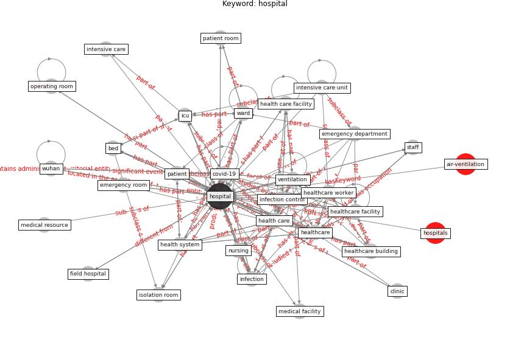

# Keyword: __hospital__
## Clusters

* Cluster 15: [water-wastewater](cluster_15)

## Concepts

 

## Top 10 articles for __hospital__
* Management of the COVID-19 pandemic: challenges,
practices, and organizational support ([hossny_management_2022](article_hossny_management_2022))
* A Review on Building Design as a Biomedical
System for Preventing COVID-19 Pandemic ([amran_review_2022](article_amran_review_2022))
* dyer_covid-19_2020 ([dyer_covid-19_2020](article_dyer_covid-19_2020))
* Designing Post COVID-19 Buildings: Approaches for
Achieving Healthy Buildings ([navaratnam_designing_2022](article_navaratnam_designing_2022))
* udomiaye_architectural_2020 ([udomiaye_architectural_2020](article_udomiaye_architectural_2020))
* Assessment of Building Automation and Control
Systems in Danish Healthcare Facilities in the
COVID-19 Era ([pedersen_assessment_2022](article_pedersen_assessment_2022))
* A Comprehensive Review of the COVID-19 Pandemic
and the Role of IoT, Drones, AI, Blockchain, and
5G in Managing its Impact ([chamola_comprehensive_2020](article_chamola_comprehensive_2020))
* How can airborne transmission of COVID-19 indoors be
minimised? ([morawska_how_2020](article_morawska_how_2020))
* COVID-19 Prevention and Control Measures in
Workplace Settings: A Rapid Review and
Meta-Analysis ([ingram_covid-19_2021](article_ingram_covid-19_2021))
* SARS-CoV-2 RNA detection of hospital isolation wards
hygiene monitoring during the Coronavirus Disease 2019
outbreak in a Chinese hospital ([wang_sars-cov-2_2020](article_wang_sars-cov-2_2020))
