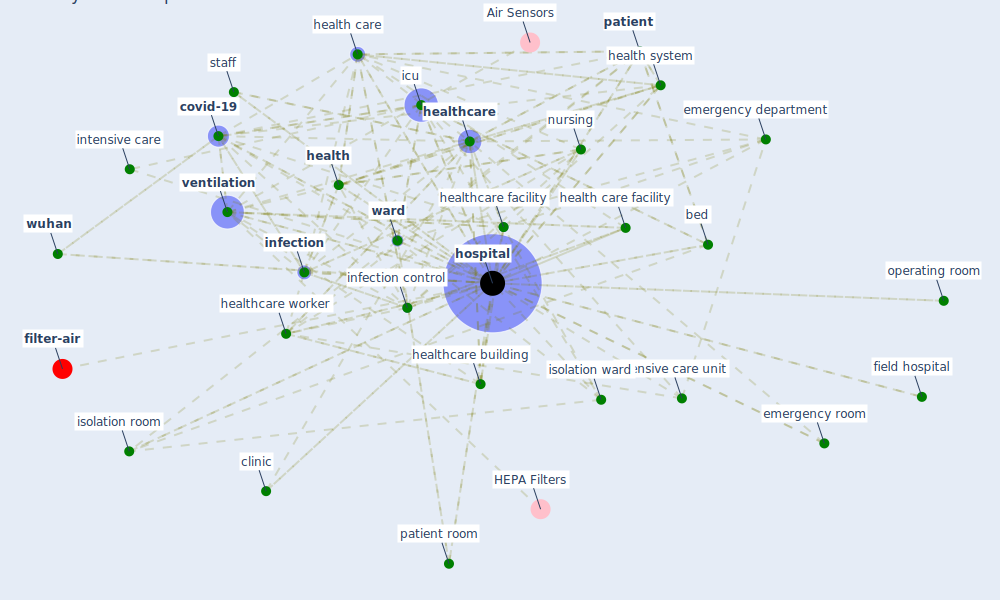

# Keyword: hospital

* [filter-air](cluster_0)

## Keywords

 * air condition, airborne isolation room, airborne transmission of disease, [airport](keyword_airport), [anteroom](keyword_anteroom), bed, beijing ditan hospital, blood bank, blood bear disease, budget, [build](keyword_build), [building](keyword_building), care system, [china](keyword_china), [city](keyword_city), [clinic](keyword_clinic), [construction](keyword_construction), [covid-19](keyword_covid-19), die, disinfect, [disinfection](keyword_disinfection), distribwhen, doctor, elective operation, emergency, emergency center, emergency department, emergency room, emergency treatment, facility, family, field hospital, floor, [health](keyword_health), [health care](keyword_health_care), health care center, health care facility, health center, health professional, [health system](keyword_health_system), [healthcare](keyword_healthcare), healthcare building, healthcare facility, healthcare professional, [healthcare system](keyword_healthcare_system), healthcare worker, hosp, [hospital](keyword_hospital), hospitalization, hotel, [icu](keyword_icu), icus, indoor airquality, [indoor environment](keyword_indoor_environment), [infection](keyword_infection), [infection control](keyword_infection_control), infectious ward, infectious waste, intensive care, intensive care unit, isolation, isolation room, isolation tent, isolation ward, leishenshan, leishenshan hospital, lifesave, makeshift hospital, [management](keyword_management), mary elizabeth hospital, [medical](keyword_medical), [negative pressure room](keyword_negative_pressure_room), [nurse](keyword_nurse), [nursing](keyword_nursing), nursing home, occupancy level, operate room, operating room, [patient](keyword_patient), patient room, post covid era, protective environment, quarantine, quarantine facility, quarantine place, rapid response team, roof air exhaust, [room](keyword_room), sanatorium, [school](keyword_school), specialist health unit, staff, tertiary referral, trauma center, unit, [ventilation](keyword_ventilation), ventilation system, [ward](keyword_ward), wastewater treatment, [wuhan](keyword_wuhan)

## Mapping

## Neighbours

### Closest articles

* A Review on Building Design as a Biomedical System for Preventing COVID-19 Pandemic - [LINK](article_amran_review_2022)
* Management of the COVID-19 pandemic: challenges, practices, and organizational support - [LINK](article_hossny_management_2022)
* COVID-19 Forced Hospitals to Build Negative Pressure Rooms Fast - [LINK](article_dyer_covid-19_2020)
* Assessment of Building Automation and Control Systems in Danish Healthcare Facilities in the COVID-19 Era - [LINK](article_pedersen_assessment_2022)
* COVID-19 Prevention and Control Measures in Workplace Settings: A Rapid Review and Meta-Analysis - [LINK](article_ingram_covid-19_2021)
* How can airborne transmission of COVID-19 indoors be minimised? - [LINK](article_morawska_how_2020)
* A review of facilities management interventions to mitigate respiratory infections in existing buildings - [LINK](article_zhang_review_2022)
* Architectural design strategies for infection prevention and control (IPC) in health-care facilities: towards curbing the spread of Covid-19 \textbar SpringerLink - [LINK](article_udomiaye_architectural_2020)
* A Comprehensive Review of the COVID-19 Pandemic and the Role of IoT, Drones, AI, Blockchain, and 5G in Managing its Impact - [LINK](article_chamola_comprehensive_2020)
* Designing Post COVID-19 Buildings: Approaches for Achieving Healthy Buildings - [LINK](article_navaratnam_designing_2022)

### Closest BPs

