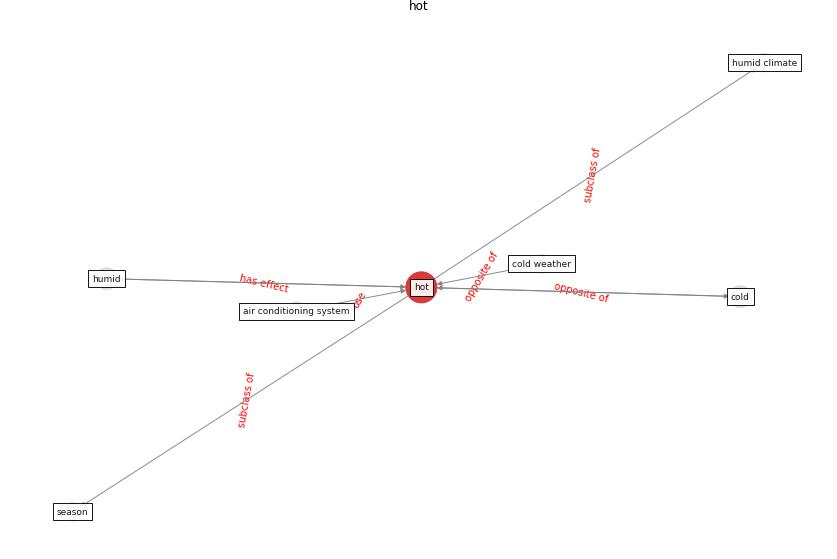

# Keyword: __hot__
## Clusters

* Cluster 5: [space-flexible](cluster_5.md)

## Concepts

 

## Articles
* The effect of occupant distribution on energy consumption
and COVID-19 infection in buildings: A case study of
university building ([mokhtari_effect_2021](article_mokhtari_effect_2021.md))
* world_green_building_council_health_2014-300 ([world_green_building_council_health_2014-300](article_world_green_building_council_health_2014-300.md))
* world_green_building_council_health_2014-0 ([world_green_building_council_health_2014-0](article_world_green_building_council_health_2014-0.md))
* Effects of temperature and humidity on the spread of
COVID-19: A systematic review ([mecenas_effects_2020](article_mecenas_effects_2020.md))
* Climate and the spread of COVID-19 ([chen_climate_2021](article_chen_climate_2021.md))
* Effects of temperature and humidity on the spread of
COVID-19: A systematic review ([mecenas_effects_2020](article_mecenas_effects_2020.md))
* An Intelligent IEQ Monitoring and Feedback
System: Development and Applications ([geng_intelligent_2021](article_geng_intelligent_2021.md))
* RUDDS_bioRxiv_update-0 ([RUDDS_bioRxiv_update-0](article_RUDDS_bioRxiv_update-0.md))
* realdania_refleksioner_2022_EN-1300 ([realdania_refleksioner_2022_EN-1300](article_realdania_refleksioner_2022_EN-1300.md))
* realdania_refleksioner_2022_EN-150 ([realdania_refleksioner_2022_EN-150](article_realdania_refleksioner_2022_EN-150.md))
