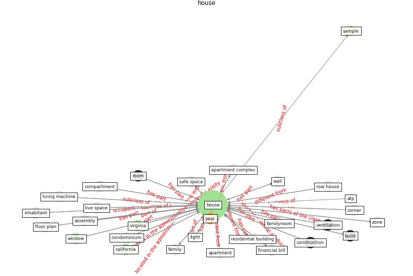

# Keyword: __house__
## Clusters

* Cluster 4: [air-formaldehyde](cluster_4.md)

## Concepts

 

## Articles
* The Effect of Opening Windows on Air Change
Rates in Two Homes ([howard-reed_effect_2002](article_howard-reed_effect_2002.md))
* Adaptive Design of the Built Environment to
Mitigate the Transmission Risk of COVID-19 ([ara_dilshad_shangi_adaptive_2020](article_ara_dilshad_shangi_adaptive_2020.md))
* Towards Resilient Residential Buildings and
Neighborhoods in Light of COVID-19 Pandemic—The
Scenario of Podgorica, Montenegro ([bojovic_towards_2022](article_bojovic_towards_2022.md))
* Towards Resilient Residential Buildings and
Neighborhoods in Light of COVID-19 Pandemic—The
Scenario of Podgorica, Montenegro ([bojovic_towards_2022](article_bojovic_towards_2022.md))
* Prophylactic Architecture: Formulating the Concept
of Pandemic-Resilient Homes ([elrayies_prophylactic_2022](article_elrayies_prophylactic_2022.md))
* Adaptive Design of the Built Environment to
Mitigate the Transmission Risk of COVID-19 ([ara_dilshad_shangi_adaptive_2020](article_ara_dilshad_shangi_adaptive_2020.md))
* Occupants’ behavior and activity patterns influencing
the energy consumption in the Kuwaiti residences ([al-mumin_occupants_2003](article_al-mumin_occupants_2003.md))
* realdania_refleksioner_2022_EN-1500 ([realdania_refleksioner_2022_EN-1500](article_realdania_refleksioner_2022_EN-1500.md))
* Adaptive Design of the Built Environment to
Mitigate the Transmission Risk of COVID-19 ([ara_dilshad_shangi_adaptive_2020](article_ara_dilshad_shangi_adaptive_2020.md))
* Adaptive Design of the Built Environment to
Mitigate the Transmission Risk of COVID-19 ([ara_dilshad_shangi_adaptive_2020](article_ara_dilshad_shangi_adaptive_2020.md))
