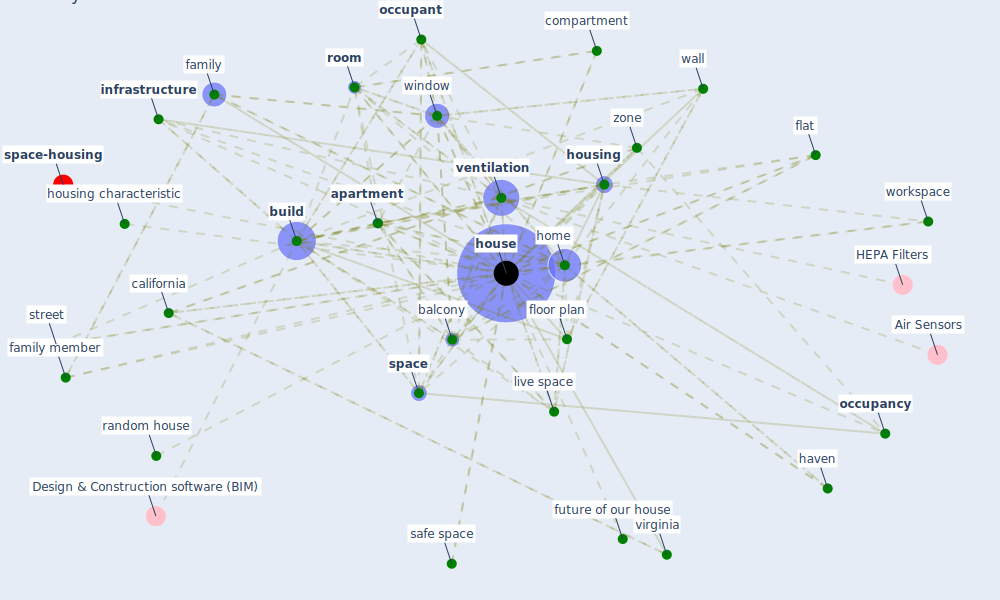

# Keyword: house

* [housing-space](cluster_14)

## Keywords

 * 150 square meter, Cluster_14, a2 agent, activity, [apartment](keyword_apartment), apartment building, apartment complex, appliance, [balcony](keyword_balcony), [build](keyword_build), [building](keyword_building), [california](keyword_california), california detach house, calm corner, compartment, [construction](keyword_construction), corbusier, corner, [covid-19](keyword_covid-19), daily life, defecate, [design](keyword_design), [energy consumption](keyword_energy_consumption), energy inefficient, energy supply, equipment, extension, family, family member, familyroom, finance, flat, floor, floor plan, four bedroom, front porch, full house, future, future of our house, [garden](keyword_garden), green corner, haven, [health and safety](keyword_health_and_safety), hold, [home](keyword_home), homeless, [house](keyword_house), houses, [housing](keyword_housing), housing characteristic, [infrastructure](keyword_infrastructure), [kuwaiti](keyword_kuwaiti), [light](keyword_light), live space, living machine, [lockdown](keyword_lockdown), my house, occupancy, [occupant](keyword_occupant), off the plan, one family housing, open window, ourhouse, outside, [plan](keyword_plan), public building, raccoon, random house, regular plan, [residential](keyword_residential), rest, [room](keyword_room), row house, safe space, [sample](keyword_sample), sample period, semi detach, share workplace, shelter, socio economic divide, sound insulation, [space](keyword_space), street, terrace house, the young age group, type of housing, [urban](keyword_urban), vacuum cleaning, [ventilation](keyword_ventilation), ventilation system, [virginia](keyword_virginia), wall, washing area, washing area washing area, white house, [window](keyword_window), window opening, work from home, workspace, zone

## Mapping

## Neighbours

### Closest articles

* The Effect of Opening Windows on Air Change Rates in Two Homes - [LINK](article_howard-reed_effect_2002)
* Adaptive Design of the Built Environment to Mitigate the Transmission Risk of COVID-19 - [LINK](article_ara_dilshad_shangi_adaptive_2020)
* Towards Resilient Residential Buildings and Neighborhoods in Light of COVID-19 Pandemic—The Scenario of Podgorica, Montenegro - [LINK](article_bojovic_towards_2022)
* Questioning the use of the balcony in apartments during the COVID-19 pandemic process - [LINK](article_aydin_questioning_2020)
* Attitudes towards outdoor and neighbour noise during the COVID-19 lockdown: A case study in London - [LINK](article_lee_attitudes_2021)
* Houses amid COVID-19: Environmental challenges and design adaptation - [LINK](article_hizra_houses_2021)
* Prophylactic Architecture: Formulating the Concept of Pandemic-Resilient Homes - [LINK](article_elrayies_prophylactic_2022)
* Occupants’ behavior and activity patterns influencing the energy consumption in the Kuwaiti residences - [LINK](article_al-mumin_occupants_2003)
* How is COVID-19 Experience Transforming Sustainability Requirements of Residential Buildings? A Review - [LINK](article_tokazhanov_how_2020)
* Biophilic design in architecture and its contributions to health, well-being, and sustainability: A critical review - [LINK](article_zhong_biophilic_2022)

### Closest BPs

