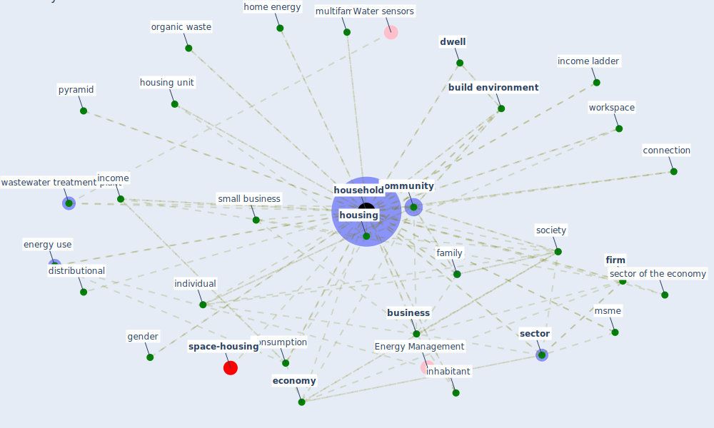

# Keyword: household

* [space-housing](cluster_4)

## Keywords

 * 0 household, Cluster_4, appliance, balance sheet, [build](keyword_build), [build environment](keyword_build_environment), [business](keyword_business), byhousehold, catchment area, characteristic, child under 12 year old, cohabitation, [community](keyword_community), connection, consumption, distributional, dust, [dwell](keyword_dwell), economic impact of the crisis, economic stagnation, [economy](keyword_economy), electricity use, [energy consumption](keyword_energy_consumption), energy efficient appliance, energy expenditure, energy use, enumeration area, family, family type, [firm](keyword_firm), fraction, gender, gender role, healthcare facility, home energy, home energy expenditure, [household](keyword_household), household balance sheet, household income, household size, household with 2 inhabitant, households, [housing](keyword_housing), housing and city, housing unit, hygienic facility, illness, impact of energy use, income, income ladder, individual, [industry](keyword_industry), inhabitant, interact with more people, investment, investment prospect, [kuwait](keyword_kuwait), livelihood, living room, low income, low income household, low socioeconomic status, lowincome, mh4, microenterprise, more member, mortgage, msme, multifamily, no child under 12 year old, organic waste, pet, pet ownership, [population](keyword_population), poverty reduction, pyramid, [recycle](keyword_recycle), resilience system, risk of illness, [sector](keyword_sector), sector of the economy, self drive car, separate hygienic facility, separate sanitation facility, share housing, size, small business, [society](keyword_society), sociodemographic variable, stay home, stay home measure, [survey](keyword_survey), [toilet](keyword_toilet), vulnerable area, wastewater treatment plant, water save efficient equipment, wide economy, woman own business, [worker](keyword_worker), workspace

## Mapping

## Neighbours

### Closest articles

* World Bank Development Report - [LINK](article_world_bank_world_2022)
* A Mixed Approach on Resilience of Spanish Dwellings and Households during COVID-19 Lockdown - [LINK](article_cuerdo-vilches_mixed_2020)
* Guidelines for resilience systems analysis - [LINK](article_oecd_guidelines_2014)
* The role of green roofs in post COVID-19 confinement: An analysis of willingness to pay - [LINK](article_manso_role_2021)
* Impacts of COVID-19 on residential building energy use and performance - [LINK](article_kawka_impacts_2021)
* Urban design attributes and resilience: COVID-19 evidence from New York City - [LINK](article_yang_urban_2021)
* Adaptive Design of the Built Environment to Mitigate the Transmission Risk of COVID-19 - [LINK](article_ara_dilshad_shangi_adaptive_2020)
* Eviction, Health Inequity, and the Spread of COVID-19: Housing Policy as a Primary Pandemic Mitigation Strategy - [LINK](article_benfer_eviction_2021)
* Readiness Assessment of Green Building Certification Systems for Residential Buildings during Pandemics - [LINK](article_tleuken_readiness_2021)
* Indirect effects of COVID-19 on the environment - [LINK](article_zambrano-monserrate_indirect_2020)

### Closest BPs

