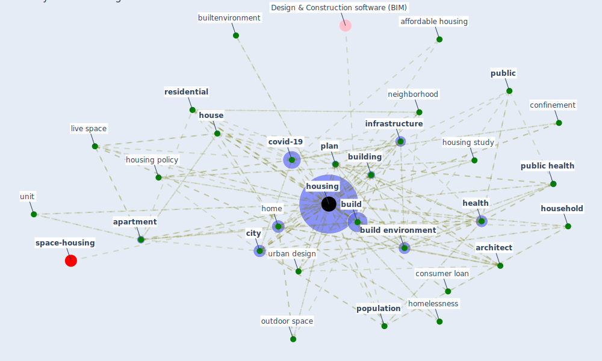

# Keyword: housing

* [housing-space](cluster_14)

## Keywords

 * add to, affordable and adequate housing, affordable housing, agglomeration, [apartment](keyword_apartment), [architect](keyword_architect), [architecture](keyword_architecture), basic need, [build](keyword_build), [build environment](keyword_build_environment), [building](keyword_building), builtenvironment, childhood housing type, [city](keyword_city), [confinement](keyword_confinement), congregate, [construction](keyword_construction), consumer loan, cost, [covid 19 pandemic](keyword_covid_19_pandemic), [covid-19](keyword_covid-19), de financialization, determinant of health, [domain](keyword_domain), domestic abuse, edu cation, [eviction](keyword_eviction), experience, [green housing](keyword_green_housing), [health](keyword_health), health inequality, health standard, healthy housing, [home](keyword_home), home floor plan, [homelessness](keyword_homelessness), [house](keyword_house), [household](keyword_household), [housing](keyword_housing), housing design, housing market, housing policy, housing program, housing scholar, housing sector, housing stock, housing study, housing type, housing unit, human need, income, [indoor environment](keyword_indoor_environment), [infrastructure](keyword_infrastructure), infrastructure of care, land use, live space, meaning of housing, mezzo, micro, [mobility](keyword_mobility), multi family, multi family house, [neighborhood](keyword_neighborhood), [occupant](keyword_occupant), outdoor space, overcrowd, overcrowded housing, page 3 of 21, [pandemic](keyword_pandemic), [plan](keyword_plan), [podgorica](keyword_podgorica), [policy](keyword_policy), poor housing, [population](keyword_population), post pandemic housing, postcovid 19, poverty, pre phthalviously discuss trend, private home, [public](keyword_public), [public health](keyword_public_health), [public housing](keyword_public_housing), quality of life, rent, rental, [residential](keyword_residential), retrofitting, socio economic, stability, storage, [sustainable architecture](keyword_sustainable_architecture), sustainable building, transportation, unit, unit area, [urban](keyword_urban), urban design, urban service, urbanization, workspace

## Mapping

## Neighbours

### Closest articles

* Dangerous liaisons? Applying the social harm perspective to the social inequality, housing and health trifecta during the Covid-19 pandemic - [LINK](article_gurney_dangerous_2021)
* COVID-19 and Green Housing: A Review of Relevant Literature - [LINK](article_kaklauskas_covid-19_2021)
* Prophylactic Architecture: Formulating the Concept of Pandemic-Resilient Homes - [LINK](article_elrayies_prophylactic_2022)
* Towards Resilient Residential Buildings and Neighborhoods in Light of COVID-19 Pandemic—The Scenario of Podgorica, Montenegro - [LINK](article_bojovic_towards_2022)
* How our homes impact our health: using a COVID-19 informed approach to examine urban apartment housing - [LINK](article_peters_how_2020)
* A Mixed Approach on Resilience of Spanish Dwellings and Households during COVID-19 Lockdown - [LINK](article_cuerdo-vilches_mixed_2020)
* The role of green roofs in post COVID-19 confinement: An analysis of willingness to pay - [LINK](article_manso_role_2021)
* Housing Experience in Gated Communities in the Time of Pandemics: Lessons Learned from COVID-19 - [LINK](article_asfour_housing_2022)
* Eviction, Health Inequity, and the Spread of COVID-19: Housing Policy as a Primary Pandemic Mitigation Strategy - [LINK](article_benfer_eviction_2021)
* Urban planning after COVID-19 - [LINK](article_rtpi_urban_2021)

### Closest BPs

