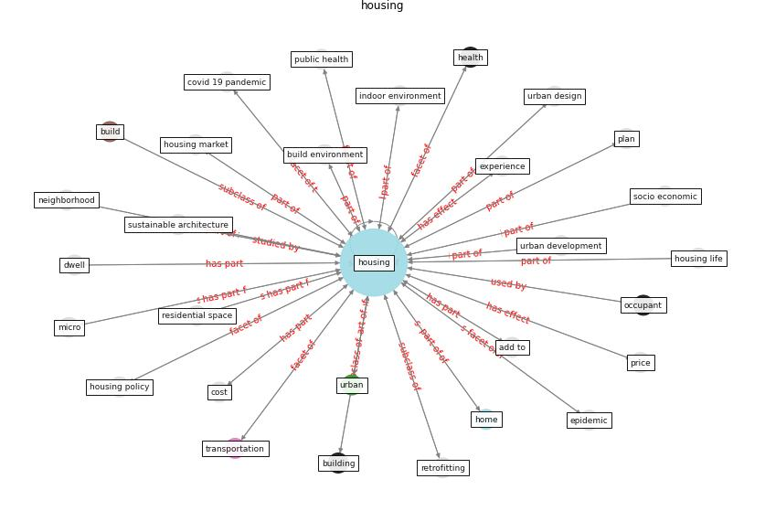

# Keyword: __housing__
## Clusters

* Cluster 13: [space-urban](cluster_13)

## Concepts

 

## Top 10 articles for __housing__
* realdania_refleksioner_2022_EN ([realdania_refleksioner_2022_EN](article_realdania_refleksioner_2022_EN))
* COVID-19 and Green Housing: A Review of
Relevant Literature ([kaklauskas_covid-19_2021](article_kaklauskas_covid-19_2021))
* Towards Resilient Residential Buildings and
Neighborhoods in Light of COVID-19 Pandemic—The
Scenario of Podgorica, Montenegro ([bojovic_towards_2022](article_bojovic_towards_2022))
* Prophylactic Architecture: Formulating the Concept
of Pandemic-Resilient Homes ([elrayies_prophylactic_2022](article_elrayies_prophylactic_2022))
* How our homes impact our health: using a COVID-19
informed approach to examine urban apartment housing ([peters_how_2020](article_peters_how_2020))
* A Mixed Approach on Resilience of Spanish
Dwellings and Households during COVID-19 Lockdown ([cuerdo-vilches_mixed_2020](article_cuerdo-vilches_mixed_2020))
* Eviction, Health Inequity, and the Spread of
COVID-19: Housing Policy as a Primary Pandemic
Mitigation Strategy ([benfer_eviction_2021](article_benfer_eviction_2021))
* Housing Experience in Gated Communities in the
Time of Pandemics: Lessons Learned from
COVID-19 ([asfour_housing_2022](article_asfour_housing_2022))
* rtpi_urban_2021 ([rtpi_urban_2021](article_rtpi_urban_2021))
* COVID-19 and Living space challenge. Well-being and
Public Health recommendations for a healthy, safe, and
sustainable housing. ([dalessandro_covid-19_2020](article_dalessandro_covid-19_2020))
