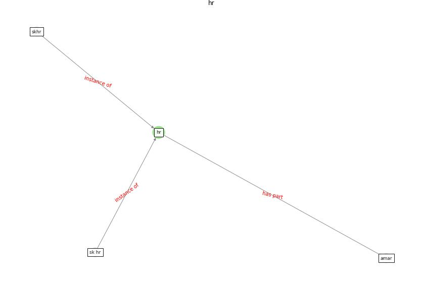

# Keyword: __hr__
## Clusters

* Cluster 4: [air-formaldehyde](cluster_4.md)

## Concepts

 

## Articles
* eurofund_sustainable_2016-300 ([eurofund_sustainable_2016-300](article_eurofund_sustainable_2016-300.md))
* Supporting Technologies for COVID-19 Prevention:
Systemized Review ([zhao_supporting_2022](article_zhao_supporting_2022.md))
* RUDDS_bioRxiv_update-0 ([RUDDS_bioRxiv_update-0](article_RUDDS_bioRxiv_update-0.md))
* realdania_refleksioner_2022_EN-1500 ([realdania_refleksioner_2022_EN-1500](article_realdania_refleksioner_2022_EN-1500.md))
* realdania_refleksioner_2022_EN-1450 ([realdania_refleksioner_2022_EN-1450](article_realdania_refleksioner_2022_EN-1450.md))
* realdania_refleksioner_2022_EN-1400 ([realdania_refleksioner_2022_EN-1400](article_realdania_refleksioner_2022_EN-1400.md))
* realdania_refleksioner_2022_EN-1350 ([realdania_refleksioner_2022_EN-1350](article_realdania_refleksioner_2022_EN-1350.md))
* realdania_refleksioner_2022_EN-1300 ([realdania_refleksioner_2022_EN-1300](article_realdania_refleksioner_2022_EN-1300.md))
* realdania_refleksioner_2022_EN-1250 ([realdania_refleksioner_2022_EN-1250](article_realdania_refleksioner_2022_EN-1250.md))
* realdania_refleksioner_2022_EN-1200 ([realdania_refleksioner_2022_EN-1200](article_realdania_refleksioner_2022_EN-1200.md))
