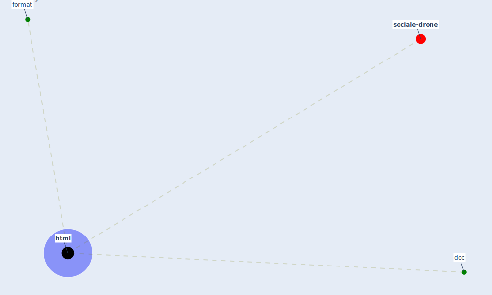

# Keyword: html

* [sociale-drone](cluster_6)

## Keywords

 * Cluster_6, doc, format, [html](keyword_html)

## Mapping

## Neighbours

### Closest articles

* Open-source analytics tools for studying the COVID-19 coronavirus outbreak - [LINK](article_wu_open-source_2020)
* Presence of SARS-Coronavirus-2 RNA in Sewage and Correlation with Reported COVID-19 Prevalence in the Early Stage of the Epidemic in The Netherlands - [LINK](article_medema_presence_2020)

### Closest BPs

