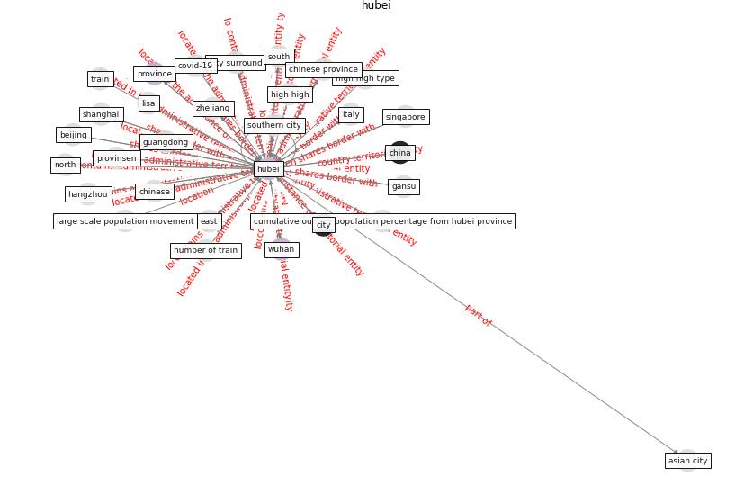

# Keyword: __hubei__
## Clusters

* Cluster 7: [liver-province](cluster_7)

## Concepts

 

## Top 10 articles for __hubei__
* Association of built environment attributes with the
spread of COVID-19 at its initial stage in China ([li_association_2021](article_li_association_2021))
* The effect of human mobility and control measures on the
COVID-19 epidemic in China ([kraemer_effect_2020](article_kraemer_effect_2020))
* Role of Information Technology in Covid-19
Prevention ([mehtab_alam_role_2021](article_mehtab_alam_role_2021))
* COVID-19 Higher Mortality in Chinese Regions
With Chronic Exposure to Lower Air Quality ([pansini_covid-19_2021](article_pansini_covid-19_2021))
* Open-source analytics tools for studying the COVID-19
coronavirus outbreak ([wu_open-source_2020](article_wu_open-source_2020))
* A Comprehensive Review of the COVID-19 Pandemic
and the Role of IoT, Drones, AI, Blockchain, and
5G in Managing its Impact ([chamola_comprehensive_2020](article_chamola_comprehensive_2020))
* How the 5G Enabled the COVID-19 Pandemic
Prevention and Control: Materiality, Affordance,
and (De-)Spatialization ([li_how_2022](article_li_how_2022))
* Design COVID-19 Ontology: A Healthcare and
Safety Perspective ([aloulou_design_2022](article_aloulou_design_2022))
* Environmental factors involved in SARS-CoV-2
transmission: effect and role of indoor environmental
quality in the strategy for COVID-19 infection control ([azuma_environmental_2020](article_azuma_environmental_2020))
* The COVID-19 pandemic: Impacts on cities and major
lessons for urban planning, design, and management ([sharifi_covid-19_2020](article_sharifi_covid-19_2020))
