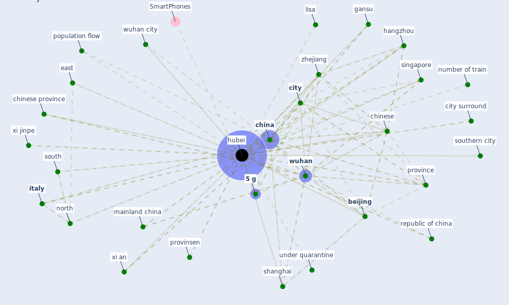

# Keyword: hubei

## Keywords

 * [5 g](keyword_5_g), asian, asian city, [beijing](keyword_beijing), [china](keyword_china), china unicom, [chinese](keyword_chinese), chinese province, [city](keyword_city), city surround, [coronavirus outbreak](keyword_coronavirus_outbreak), [covid-19](keyword_covid-19), cumulative outflow population percentage from hubei province, east, gansu, guangdong, hangzhou, high high, high high type, [hubei](keyword_hubei), [italy](keyword_italy), large scale population movement, lisa, mainland china, north, number of train, pandemic in china, population flow, [province](keyword_province), provinsen, republic of china, [shanghai](keyword_shanghai), singapore, south, southern city, train, under quarantine, [wuhan](keyword_wuhan), wuhan city, xi an, xi jinpe, zhejiang

## Mapping

## Neighbours

### Closest articles

* Association of built environment attributes with the spread of COVID-19 at its initial stage in China - [LINK](article_li_association_2021)
* The effect of human mobility and control measures on the COVID-19 epidemic in China - [LINK](article_kraemer_effect_2020)
* An investigation of transmission control measures during the first 50 days of the COVID-19 epidemic in China - [LINK](article_tian_investigation_2020)
*  - [LINK](article_mehtab_alam_role_2021)
* COVID-19 Higher Mortality in Chinese Regions With Chronic Exposure to Lower Air Quality - [LINK](article_pansini_covid-19_2021)
* Study of COVID-19 pandemic in London (UK) from urban context - [LINK](article_ghosh_study_2020)
* Open-source analytics tools for studying the COVID-19 coronavirus outbreak - [LINK](article_wu_open-source_2020)
* A Comprehensive Review of the COVID-19 Pandemic and the Role of IoT, Drones, AI, Blockchain, and 5G in Managing its Impact - [LINK](article_chamola_comprehensive_2020)
* Design COVID-19 Ontology: A Healthcare and Safety Perspective - [LINK](article_aloulou_design_2022)
* How the 5G Enabled the COVID-19 Pandemic Prevention and Control: Materiality, Affordance, and (De-)Spatialization - [LINK](article_li_how_2022)

### Closest BPs

