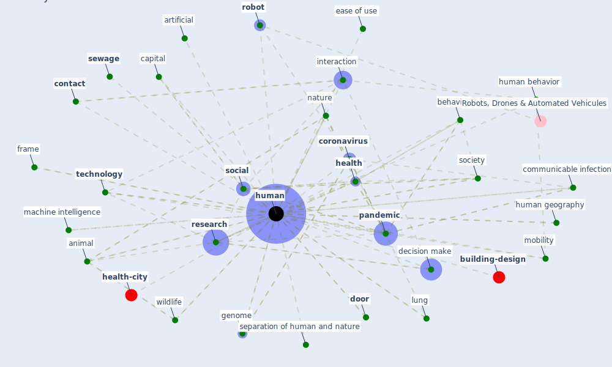

# Keyword: human

* [health-city](cluster_1)

* [building-design](cluster_5)

## Keywords

 * Cluster_1, Cluster_5, animal, anthropogenic, artificial, autonomous driving, autonomous system, behavior, behaviour, [bound box](keyword_bound_box), [build](keyword_build), capital, [china](keyword_china), cingulate, class, cognitive ability, communicable infection, [construction industry](keyword_construction_industry), [contact](keyword_contact), [coronavirus](keyword_coronavirus), correspond author, covariate, [covid 19 pandemic](keyword_covid_19_pandemic), decision make, decisionmake, detection algorithm, detection and identification, directly affect, [door](keyword_door), ease of use, [economic](keyword_economic), economic damage, excreta, excretion, exoskeleton, flee towards it, frame, [genome](keyword_genome), geography, guinea pig, harmful effect of uv ray, [health](keyword_health), homo, host, [human](keyword_human), human behavior, human geography, humans, [impact](keyword_impact), infectious disease outbreak, influenza a h5n1, [interaction](keyword_interaction), laboursave, lung, machine, machine intelligence, [malaria](keyword_malaria), mammalian, microbiome, microbiota, [mobility](keyword_mobility), mucus barrier, [nature](keyword_nature), neurotoxin, non human health, one health, [organisation](keyword_organisation), overpopulation, [pandemic](keyword_pandemic), parainfluenza virus 1, performance, population density, posture, problem, problem of this scale, [public health](keyword_public_health), publichealth, quality of life, relate life, [research](keyword_research), respiratory tract, [robot](keyword_robot), safe navigation service, scientific community, [security](keyword_security), separation of human and nature, [sewage](keyword_sewage), sex, [social](keyword_social), [society](keyword_society), [space](keyword_space), [spread](keyword_spread), [system](keyword_system), [technology](keyword_technology), tissue, urinary, [virus](keyword_virus), walk, why the virus suddenly emerge, [wildlife](keyword_wildlife)

## Mapping

## Neighbours

### Closest articles

* Green infrastructure through the lens of “One Health”: A systematic review and integrative framework uncovering synergies and trade-offs between mental health and wildlife support in cities - [LINK](article_felappi_green_2020)
* How Architecture Fails in Conditions of Crisis: a Discussion on the Value of Interior Design over the COVID-19 Outbreak - [LINK](article_rassia_how_2020)
* Health, Wellbeing \& Productivity in Offices - [LINK](article_world_green_building_council_health_2014)
* The socio-economic determinants of COVID-19: A spatial analysis of German county level data - [LINK](article_ehlert_socio-economic_2021)
* DeepSOCIAL: Social Distancing Monitoring and Infection Risk Assessment in COVID-19 Pandemic - [LINK](article_rezaei_deepsocial_2020)
* Guidelines for resilience systems analysis - [LINK](article_oecd_guidelines_2014)
* A Comprehensive Review of the COVID-19 Pandemic and the Role of IoT, Drones, AI, Blockchain, and 5G in Managing its Impact - [LINK](article_chamola_comprehensive_2020)
* COVID19-Routes: A Safe Pedestrian Navigation Service - [LINK](article_cantarero_covid19-routes_2021)
* An Overview of Biomedical Ontologies for Pandemics and Infectious Diseases Representation - [LINK](article_bayoudhi_overview_2021)
* COVID-19: Risk assessment and mitigation measures in healthcare and non-healthcare workplaces - [LINK](article_fawzy_covid-19_2021)

### Closest BPs

