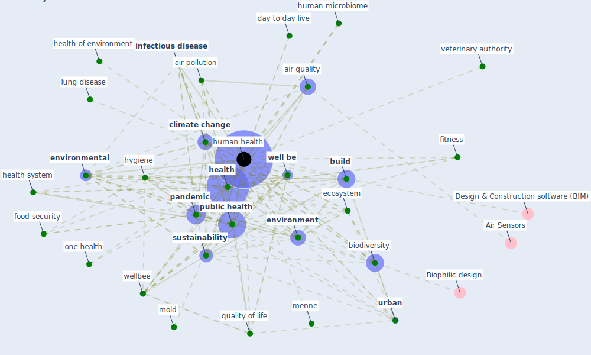

# Keyword: human health

## Keywords

 * [adaptation](keyword_adaptation), [air](keyword_air), [air pollutant](keyword_air_pollutant), [air pollution](keyword_air_pollution), air pollution regulation, air quality, airborne disease, akhtar, animalhealth, atmospheric moisture, bad air quality, [biodiversity](keyword_biodiversity), [build](keyword_build), building environment, [climate change](keyword_climate_change), co benefits, confalonieri, [covid 19 crisis](keyword_covid_19_crisis), [covid 19 pandemic](keyword_covid_19_pandemic), current covid 19 pandemic, current pandemic, day to day live, difficult and persistent situation risk, earth, [ecosystem](keyword_ecosystem), [environment](keyword_environment), [environmental](keyword_environmental), [epidemiological](keyword_epidemiological), fall sick, fitness, food security, forecast rvf, free, globalization, green blue space, [health](keyword_health), health in building, health of environment, [health system](keyword_health_system), [healthcare](keyword_healthcare), [human health](keyword_human_health), human health and wellbeing, human health effect of air pollution, human microbiome, hygiene, [iaq](keyword_iaq), [impact](keyword_impact), [indoor environment](keyword_indoor_environment), [infectious disease](keyword_infectious_disease), livestock, lung disease, menne, microbiome, [mitigation](keyword_mitigation), mitigation method, mold, one health, [pandemic](keyword_pandemic), [pathogen](keyword_pathogen), [pollution](keyword_pollution), [public health](keyword_public_health), public health domain, quality of life, research paradigm, situation risk, [society](keyword_society), [sustainability](keyword_sustainability), sustainable design, unintended harm, [urban](keyword_urban), urban build environment, urban design, veterinary authority, water engineering, [well be](keyword_well_be), well urban design, [wellbee](keyword_wellbee)

## Mapping

## Neighbours

### Closest articles

* Green infrastructure through the lens of “One Health”: A systematic review and integrative framework uncovering synergies and trade-offs between mental health and wildlife support in cities - [LINK](article_felappi_green_2020)
* How COVID-19 Redefines the Concept of Sustainability - [LINK](article_hakovirta_how_2020)
* The impact of climate change on the epidemiology and control of Rift Valley fever - PubMed - [LINK](article_martin_impact_2008)
* Learning from pandemics: Applying resilience thinking to identify priorities for planning urban settlements - [LINK](article_syal_learning_2021)
* Readiness Assessment of Green Building Certification Systems for Residential Buildings during Pandemics - [LINK](article_tleuken_readiness_2021)
* Green spaces, especially forest, linked to lower SARS-CoV-2 infection rates: A one-year nationwide study - [LINK](article_jiang_green_2021)
* A comprehensive review on indoor air quality monitoring systems for enhanced public health - [LINK](article_saini_comprehensive_2020)
* A Review on Building Design as a Biomedical System for Preventing COVID-19 Pandemic - [LINK](article_amran_review_2022)
* Architectural Design Drives the Biogeography of Indoor Bacterial Communities - [LINK](article_kembel_architectural_2014)
* Prototype Early Warning Systems for Vector-Borne Diseases in Europe - [LINK](article_semenza_prototype_2015)

### Closest BPs

