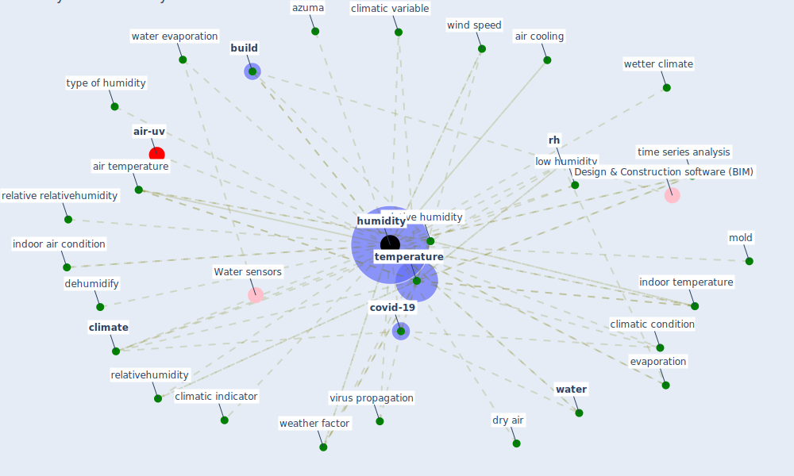

# Keyword: humidity

* [air-uv](cluster_10)

## Keywords

 * 80 humidity, Cluster_10, [aerosol](keyword_aerosol), air condition, air cooling, air quality, air temperature, airflow, ambient air, ambient air temperature, atmosphere, azuma, [build](keyword_build), cli matic, [climate](keyword_climate), climatic condition, climatic indicator, climatic variable, coronavirus aerosol, covid 19 transmission, [covid-19](keyword_covid-19), dehumidify, drier, drier condition, dry air, engineering control, evaporation, heat, heat index, humid climate, humider air, humidities, [humidity](keyword_humidity), humidity subj ofventilation, indoor air, indoor air condition, indoor temperature, intermediate humidity, low humidity, meteorological, mh1, mid range, mild to low humidity, mold, population density, relative, relative humidity, relative relativehumidity, relativehumidity, respirable, [rh](keyword_rh), [sensor](keyword_sensor), setpoint, specific humidity, spread of the virus, [temperature](keyword_temperature), time series analysis, [type](keyword_type), type of humidity, uvgi system, virus propagation, virus survival, [water](keyword_water), water evaporation, weather, weather condition, weather factor, weather variable, wetter climate, wind speed

## Mapping

## Neighbours

### Closest articles

* Effects of temperature and humidity on the spread of COVID-19: A systematic review - [LINK](article_mecenas_effects_2020)
* ASHRAE Position Document on Infectious Aerosols - [LINK](article_ashrae_ashrae_2022)
* Mechanistic insights into the effect of humidity on airborne influenza virus survival, transmission and incidence - [LINK](article_marr_mechanistic_2019)
* Study of COVID-19 pandemic in London (UK) from urban context - [LINK](article_ghosh_study_2020)
* Assessment method for new sustainability indicators providing pandemic resilience for residential buildings - [LINK](article_tokazhanov_assessment_2021)
* A critical review of heating, ventilation, and air conditioning (HVAC) systems within the context of a global SARS-CoV-2 epidemic - [LINK](article_elsaid_critical_2021)
* Scalable IoT Architecture for Monitoring IEQ Conditions in Public and Private Buildings - [LINK](article_calvo_scalable_2022)
* Review and comparison of HVAC operation guidelines in different countries during the COVID-19 pandemic - [LINK](article_guo_review_2021)
* Readiness Assessment of Green Building Certification Systems for Residential Buildings during Pandemics - [LINK](article_tleuken_readiness_2021)
* The COVID-19 pandemic: Impacts on cities and major lessons for urban planning, design, and management - [LINK](article_sharifi_covid-19_2020)

### Closest BPs

