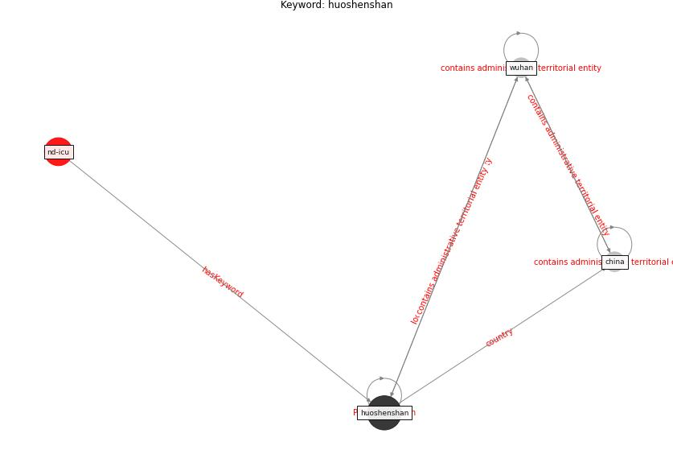

# Keyword: huoshenshan

* [nd-icu](cluster_Cluster_0)

## Keywords

 * Cluster_0, [china](keyword_china), [huoshenshan](keyword_huoshenshan), [wuhan](keyword_wuhan)

## Concepts

 

## Neighbours

### Closest articles

* Aerosol and Surface Distribution of Severe Acute Respiratory Syndrome Coronavirus 2 in Hospital Wards, Wuhan, China, 2020 - [LINK](article_guo_aerosol_2020)
* A Comprehensive Review of the COVID-19 Pandemic and the Role of IoT, Drones, AI, Blockchain, and 5G in Managing its Impact - [LINK](article_chamola_comprehensive_2020)

### Closest BPs

