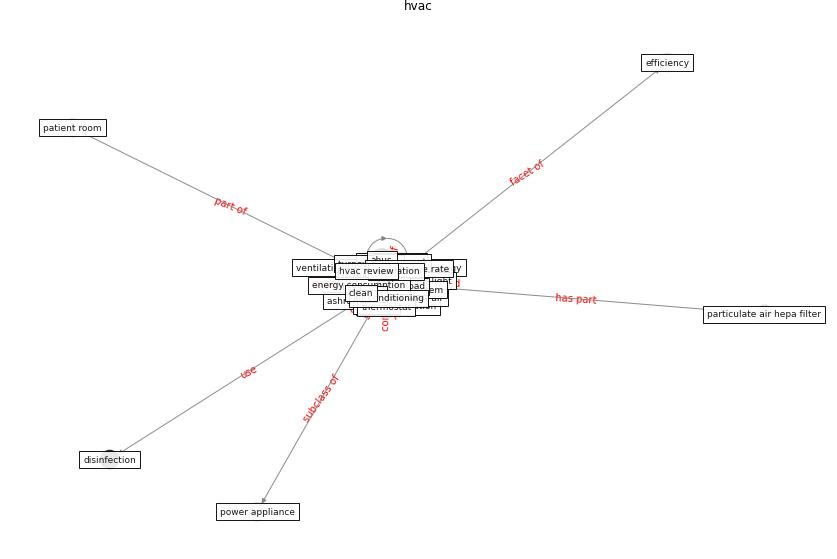

# Keyword: hvac

* [air-uv](cluster_Cluster_2)

## Keywords

 * ahu, ahus, [air](keyword_air), air condition, [air conditioning](keyword_air_conditioning), air conditioning system, air conditioning unit, air duct cleaners association, air exchange rate, [air filter](keyword_air_filter), air inlet plenum, air quality, air recirculation, air supply, airborne pathogen transmission, airborne transmission, airborne virus transmission, airflow, airstream, arco, [ashrae](keyword_ashrae), ashrae handbook, botanical filter, [build](keyword_build), [clean](keyword_clean), condition, [covid 19 pandemic](keyword_covid_19_pandemic), [covid-19](keyword_covid-19), device, duct, ductwork, efficiency, electricity, [energy](keyword_energy), energy con sumption, [energy consumption](keyword_energy_consumption), [energy use](keyword_energy_use), energyplus, equipment, exhaust fan, fan, [filter](keyword_filter), filtration, flush, furnace, heat pump, heat the internal air, heating, heating ventilating and air conditioning, heating ventilation and air conditioning, [home](keyword_home), home energy monitoring system, housekeep, [hvac](keyword_hvac), hvac equipment, hvac load, hvac system, in duct, in duct uv system, indoor air cleaning, [indoor environment](keyword_indoor_environment), [infection](keyword_infection), k s cetin, lev system, load, loadsanalysis, nembhard, non hvac, occupant density, of fice, operate time, outside air damper, [pandemic](keyword_pandemic), particle filtration, plenum, plug load, pmv, recirculate air, recirculation, renovation, residential, rlt, [sar cov 2](keyword_sar_cov_2), strategy, [system](keyword_system), [temperature](keyword_temperature), [thermostat](keyword_thermostat), thermosystem, turnover plan, [ultraviolet](keyword_ultraviolet), ultraviolet air and surface treatment, ultraviolet light, [uv](keyword_uv), [uvgi](keyword_uvgi), [ventilation](keyword_ventilation), ventilation and air cleaning strategy, ventilation equipment, [ventilation system](keyword_ventilation_system), vertical air filtration unit, [window](keyword_window)

## Concepts

 

## Neighbours

### Closest articles

* A critical review of heating, ventilation, and air conditioning (HVAC) systems within the context of a global SARS-CoV-2 epidemic - [LINK](article_elsaid_critical_2021)
* Review and comparison of HVAC operation guidelines in different countries during the COVID-19 pandemic - [LINK](article_guo_review_2021)
* Impacts of COVID-19 on residential building energy use and performance - [LINK](article_kawka_impacts_2021)
* Ventilation use in nonmedical settings during COVID-19: Cleaning protocol, maintenance, and recommendations - [LINK](article_nembhard_ventilation_2020)
* The effect of occupant distribution on energy consumption and COVID-19 infection in buildings: A case study of university building - [LINK](article_mokhtari_effect_2021)
* A review of facilities management interventions to mitigate respiratory infections in existing buildings - [LINK](article_zhang_review_2022)
* ASHRAE Position Document on Infectious Aerosols - [LINK](article_ashrae_ashrae_2022)
* Heating, ventilation and air-conditioning systems in the context of COVID-19 - [LINK](article_ecdc_heating_2020)
* Characterization and performance evaluation of a full-scale activated carbon-based dynamic botanical air filtration system for improving indoor air quality - [LINK](article_wang_characterization_2011)
* Designing Post COVID-19 Buildings: Approaches for Achieving Healthy Buildings - [LINK](article_navaratnam_designing_2022)

### Closest BPs

