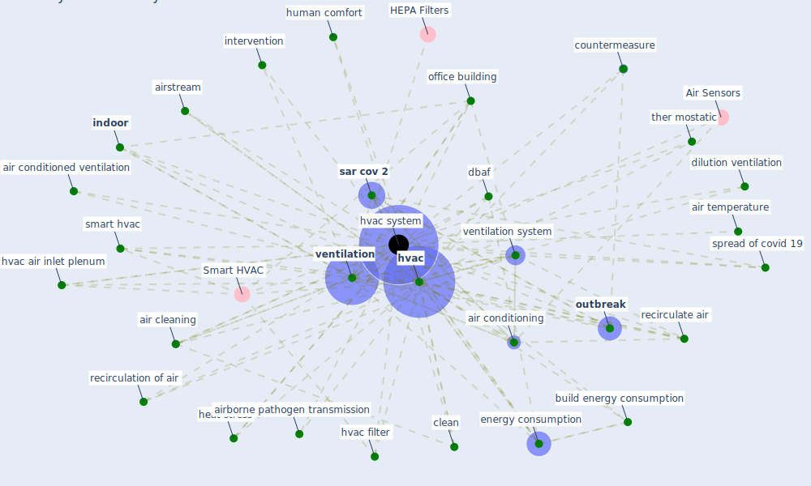

# Keyword: hvac system

## Keywords

 * Smart HVAC, adl, adls, ahus, [air](keyword_air), air cleaning, air conditioned ventilation, [air conditioning](keyword_air_conditioning), air exchange rate, air purification, air recirculate, air temperature, airborne pathogen transmission, airstream, background noise, [build](keyword_build), build energy consumption, cardiac intensive care unit, [clean](keyword_clean), cool tower, countermeasure, [covid 19 pandemic](keyword_covid_19_pandemic), covid 19pandemic, [covid-19](keyword_covid-19), [dbaf](keyword_dbaf), dilution ventilation, [disinfect](keyword_disinfect), disinfect air, effect the acoustic measure, energy consump tion, [energy consumption](keyword_energy_consumption), energy simulation, energyplus, exhaust air duct, eye, fan, [filter](keyword_filter), heat stress, [home](keyword_home), housekeep, human comfort, [hvac](keyword_hvac), hvac air inlet plenum, hvac filter, [hvac system](keyword_hvac_system), hvac systems, hvac use, hvid 19, [indoor](keyword_indoor), indoor air cleaning, [indoor air quality](keyword_indoor_air_quality), [indoor environment](keyword_indoor_environment), intervention, infiltration, infiltration system, modification of hvac system in the event of a covid 19 pandemic, office building, office, [outbreak](keyword_outbreak), recirculate, recirculate air, recirculation of air, run time of hvac system, [sar cov 2](keyword_sar_cov_2), sewage system, smart hvac, [spread](keyword_spread), spread of covid 19, [temperature](keyword_temperature), temperature set point, ther mostatic, [thermostat](keyword_thermostat), [uv](keyword_uv), [ventilation](keyword_ventilation), ventilation rate, ventilation system, țurcanu, filtration

## Mapping

## Neighbours

### Closest articles

* Review and comparison of HVAC operation guidelines in different countries during the COVID-19 pandemic - [LINK](article_guo_review_2021)
* A critical review of heating, ventilation, and air conditioning (HVAC) systems within the context of a global SARS-CoV-2 epidemic - [LINK](article_elsaid_critical_2021)
* Ventilation use in nonmedical settings during COVID-19: Cleaning protocol, maintenance, and recommendations - [LINK](article_nembhard_ventilation_2020)
* The effect of occupant distribution on energy consumption and COVID-19 infection in buildings: A case study of university building - [LINK](article_mokhtari_effect_2021)
* A review of facilities management interventions to mitigate respiratory infections in existing buildings - [LINK](article_zhang_review_2022)
* Reflecting on Impacts of COVID19 on Sustainable Buildings and Cities - [LINK](article_gonzalez_reflecting_2021)
* Characterization and performance evaluation of a full-scale activated carbon-based dynamic botanical air filtration system for improving indoor air quality - [LINK](article_wang_characterization_2011)
* Impacts of COVID-19 on residential building energy use and performance - [LINK](article_kawka_impacts_2021)
* Air Disinfection for Airborne Infection Control with a Focus on COVID‐19: Why Germicidal UV is Essential             † - [LINK](article_nardell_air_2021)
* Prophylactic Architecture: Formulating the Concept of Pandemic-Resilient Homes - [LINK](article_elrayies_prophylactic_2022)

### Closest BPs

