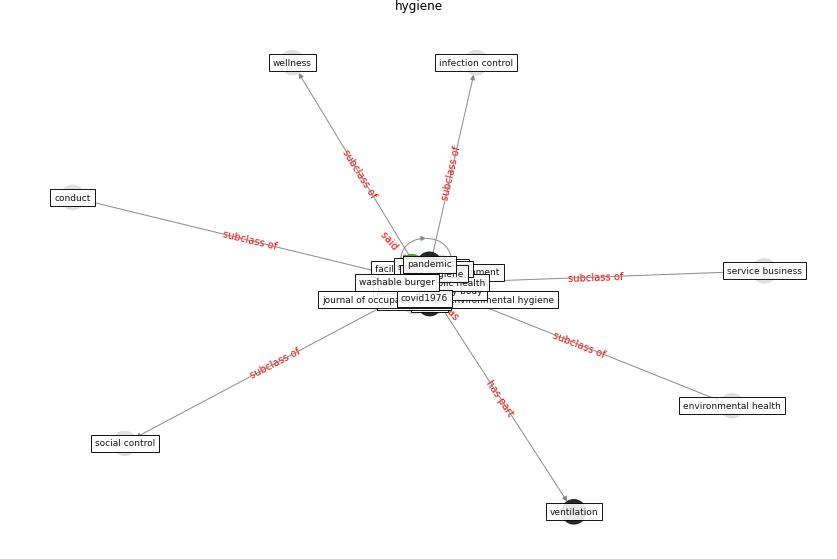

# Keyword: __hygiene__

## Concepts

 

## Top articles for __hygiene__
* Adaptive Design of the Built Environment to
Mitigate the Transmission Risk of COVID-19 ([ara_dilshad_shangi_adaptive_2020](article_ara_dilshad_shangi_adaptive_2020))
* COVID-19 and Living space challenge. Well-being and
Public Health recommendations for a healthy, safe, and
sustainable housing. ([dalessandro_covid-19_2020](article_dalessandro_covid-19_2020))
* Physical interventions to interrupt or reduce the spread
of respiratory viruses: systematic review ([jefferson_physical_2008](article_jefferson_physical_2008))
* Reframe how to serve your community in the midst of a
pandemic ([sutton_reframe_2020](article_sutton_reframe_2020))
