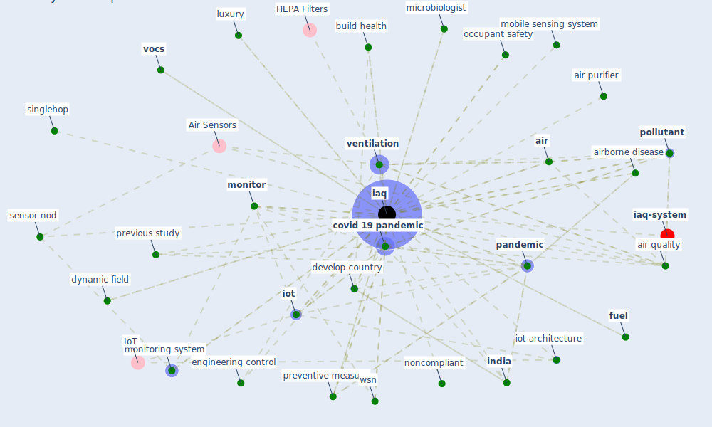

# Keyword: iaq

* [iaq-system](cluster_3)

## Keywords

 * Cluster_3, acoustic, [air](keyword_air), air disinfection, air handling, air handling equipment, air purifier, air quality, airborne disease, airborne infection control, arduino, arima, arima prediction model, build health, co2 concentration, [covid 19 pandemic](keyword_covid_19_pandemic), [covid-19](keyword_covid-19), develop country, disease spread by the air, dynamic field, eco nomic, eco nomic outcome, electronic nose, engineering control, [filter](keyword_filter), flowchart, foobot, [fuel](keyword_fuel), gaseous pollutant, hardware, hardware test, health challenge, [human health](keyword_human_health), [hvac](keyword_hvac), [iaq](keyword_iaq), iaq monitoring, iaq monitoring system, [india](keyword_india), [indoor air quality](keyword_indoor_air_quality), [indoor environment](keyword_indoor_environment), indoor environment quality, insidest, intervention, [iot](keyword_iot), iot architecture, luxury, luxury parameter, [management](keyword_management), microbiologist, mobile sensing system, [monitor](keyword_monitor), monitoring system, monodraught, noncompliant, occupant safety, [pandemic](keyword_pandemic), php, [pollutant](keyword_pollutant), preventive measure, previous study, proceeding of ashrae iaq, respiratory disease, sensor calibration, sensor nod, singlehop, sustainable building, thermo hygrometric, [ventilation](keyword_ventilation), ventilation system, vitoria gasteiz, [vocs](keyword_vocs), web portal, web server, wsn, [zigbee](keyword_zigbee)

## Mapping

## Neighbours

### Closest articles

* A comprehensive review on indoor air quality monitoring systems for enhanced public health - [LINK](article_saini_comprehensive_2020)
* Indoor Air Quality: Rethinking rules of building design strategies in post-pandemic architecture - [LINK](article_megahed_indoor_2021)
* An Intelligent IEQ Monitoring and Feedback System: Development and Applications - [LINK](article_geng_intelligent_2021)
* A Review on Building Design as a Biomedical System for Preventing COVID-19 Pandemic - [LINK](article_amran_review_2022)
* A review of facilities management interventions to mitigate respiratory infections in existing buildings - [LINK](article_zhang_review_2022)
* A critical review of heating, ventilation, and air conditioning (HVAC) systems within the context of a global SARS-CoV-2 epidemic - [LINK](article_elsaid_critical_2021)
* Scalable IoT Architecture for Monitoring IEQ Conditions in Public and Private Buildings - [LINK](article_calvo_scalable_2022)
* Ten questions concerning occupant health in buildings during normal operations and extreme events including the COVID-19 pandemic - [LINK](article_awada_ten_2021)
* Continuous IEQ monitoring system: Context and development - [LINK](article_parkinson_continuous_2019)
* Ventilation use in nonmedical settings during COVID-19: Cleaning protocol, maintenance, and recommendations - [LINK](article_nembhard_ventilation_2020)

### Closest BPs

