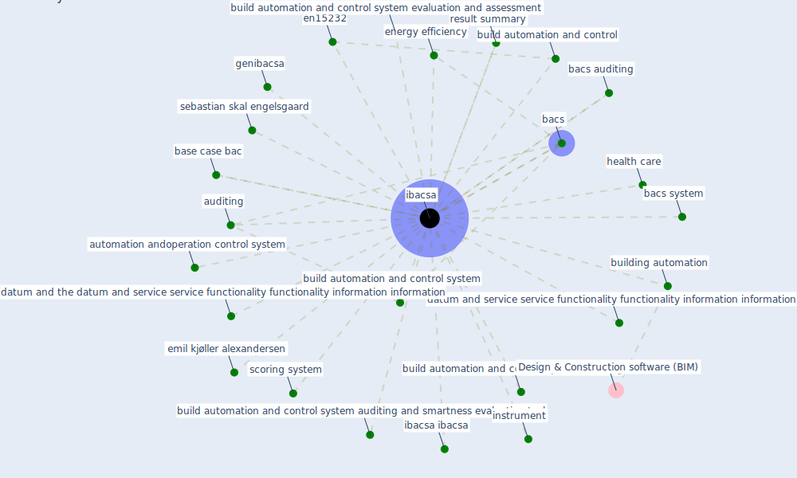

# Keyword: ibacsa

## Keywords

 * auditing, automation andoperation control system, [bacs](keyword_bacs), bacs auditing, bacs system, base case bac, build automation and control, build automation and control system, build automation and control system auditing, build automation and control system auditing and smartness evaluation tool, build automation and control system evaluation and assessment, building automation, datum and service service functionality functionality information information, datum and the datum and service service functionality functionality information information, emil kjøller alexandersen, en15232, [energy efficiency](keyword_energy_efficiency), genibacsa, [health care](keyword_health_care), [ibacsa](keyword_ibacsa), ibacsa ibacsa, instrument, result summary, scoring system, sebastian skal engelsgaard

## Mapping

## Neighbours

### Closest articles

* Assessment of Building Automation and Control Systems in Danish Healthcare Facilities in the COVID-19 Era - [LINK](article_pedersen_assessment_2022)

### Closest BPs

