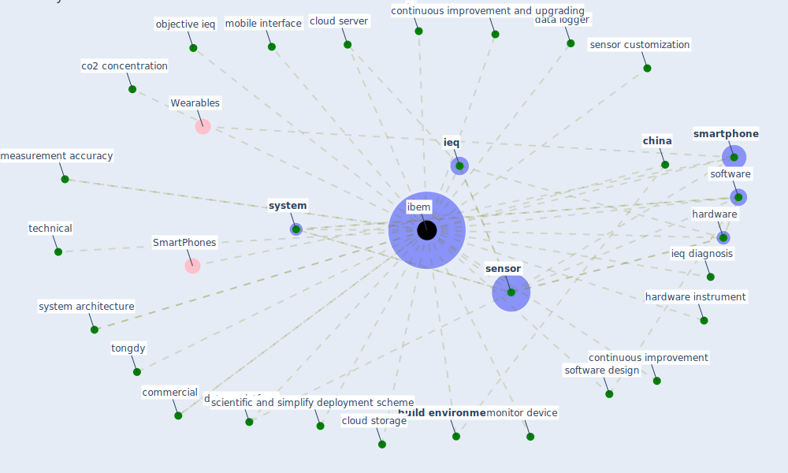

# Keyword: ibem

## Keywords

 * [build environment](keyword_build_environment), build environment measurement, [china](keyword_china), cloud server, cloud storage, co2 concentration, commercial, continuous improvement, continuous improvement and upgrading, data logger, datum platform, feedback, [formaldehyde](keyword_formaldehyde), hardware, hardware instrument, [ibem](keyword_ibem), [ieq](keyword_ieq), ieq condition, ieq diagnosis, ieq monitoring, ieq optimization, ieq parameter, illuminance sensor, [infection](keyword_infection), information interaction, intelligent ieq, intelligent ieq monitoring, [interaction](keyword_interaction), iq, iq monitor, market device, measurement accuracy, mobile interface, monitor device, objective ieq, scientific and simplify deployment scheme, [sensor](keyword_sensor), sensor customization, [smartphone](keyword_smartphone), software, software design, [system](keyword_system), system architecture, technical, tongdy

## Mapping

## Neighbours

### Closest articles

* An Intelligent IEQ Monitoring and Feedback System: Development and Applications - [LINK](article_geng_intelligent_2021)

### Closest BPs

