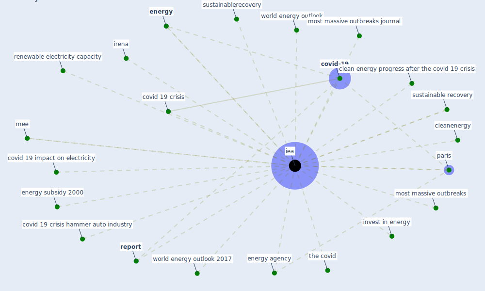

# Keyword: iea

## Keywords

 * clean energy progress after the covid 19 crisis, cleanenergy, [covid 19 crisis](keyword_covid_19_crisis), covid 19 crisis hammer auto industry, covid 19 impact on electricity, [covid-19](keyword_covid-19), [energy](keyword_energy), energy agency, energy subsidy 2000, [iea](keyword_iea), invest in energy, irena, mee, most massive outbreaks, most massive outbreaks journal, paris, renewable electricity capacity, [report](keyword_report), sustainable recovery, sustainablerecovery, the covid, world energy outlook, world energy outlook 2017

## Mapping

## Neighbours

### Closest articles

* Covid-19 and the politics of sustainable energy transitions - [LINK](article_kuzemko_covid-19_2020)
* Contextualizing the Covid-19 pandemic for a carbon-constrained world: Insights for sustainability transitions, energy justice, and research methodology - [LINK](article_sovacool_contextualizing_2020)
* A comprehensive review on indoor air quality monitoring systems for enhanced public health - [LINK](article_saini_comprehensive_2020)
* Readiness Assessment of Green Building Certification Systems for Residential Buildings during Pandemics - [LINK](article_tleuken_readiness_2021)
* Assessment method for new sustainability indicators providing pandemic resilience for residential buildings - [LINK](article_tokazhanov_assessment_2021)
* Reflecting on Impacts of COVID19 on Sustainable Buildings and Cities - [LINK](article_gonzalez_reflecting_2021)
* Knowledge, attitudes, and practices of Indonesian residents regarding COVID-19: A national cross-sectional survey - [LINK](article_yodang_knowledge_2021)
* A critical analysis of the impacts of COVID-19 on the global economy and ecosystems and opportunities for circular economy strategies - [LINK](article_ibn-mohammed_critical_2021)

### Closest BPs

