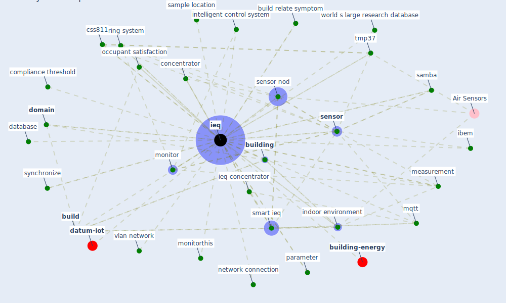

# Keyword: ieq

* [building-design](cluster_5)

## Keywords

 * Cluster_5, air quality, benchmarke, [big datum](keyword_big_datum), [build](keyword_build), build relate symptom, [building](keyword_building), building monitoring, building monitoring system, building operator, category, chinese building, christhina candido, [cloud](keyword_cloud), cloud server, comfort, [compliance](keyword_compliance), compliance calculation and ieq rating, compliance performance, compliance range, compliance threshold, compliance time calculation, concenplotte, concenplotte capability, concentrator, continuously measure time serie, css811, database, datum resolution, [domain](keyword_domain), end use, [energy efficiency](keyword_energy_efficiency), evaluation, fix ip address, floor, good practice, hardware, health and well be, hmi, [home](keyword_home), [ibem](keyword_ibem), [ieq](keyword_ieq), ieq concentrator, ieq monitoring system, [indoor environment](keyword_indoor_environment), indoor environment quality, indoor quality factor factor, [information](keyword_information), intelligent control system, intelligent ieq monitoring and feedback system, [interaction](keyword_interaction), ip address, iwiq, measurement, microcontroller, [monitor](keyword_monitor), monitoring system, monitorthis, monitory, monitory monitory system, monitory system, [mqtt](keyword_mqtt), mqtt broker, network connection, network topology, [node](keyword_node), non time critical, objective ieq result, occupant opinion, occupant satisfaction, operator, [parameter](keyword_parameter), poor, previous understanding, python, python programming, [samba](keyword_samba), sample location, sense system, [sensor](keyword_sensor), sensor network, sensor nod, shortterm performance, simulate, [smart](keyword_smart), [smart ieq](keyword_smart_ieq), [space](keyword_space), staff office, synchronize, tech3, time serie, tive, tmp37, trator, u s, vlan network, vote, web service, workspace satisfaction, world s large research database

## Mapping

## Neighbours

### Closest articles

* Scalable IoT Architecture for Monitoring IEQ Conditions in Public and Private Buildings - [LINK](article_calvo_scalable_2022)
* An Intelligent IEQ Monitoring and Feedback System: Development and Applications - [LINK](article_geng_intelligent_2021)
* Continuous IEQ monitoring system: Context and development - [LINK](article_parkinson_continuous_2019)
* Ten questions concerning occupant health in buildings during normal operations and extreme events including the COVID-19 pandemic - [LINK](article_awada_ten_2021)
* Designing Post COVID-19 Buildings: Approaches for Achieving Healthy Buildings - [LINK](article_navaratnam_designing_2022)
* ASHRAE Position Document on Infectious Aerosols - [LINK](article_ashrae_ashrae_2022)
* Prophylactic Architecture: Formulating the Concept of Pandemic-Resilient Homes - [LINK](article_elrayies_prophylactic_2022)
* A comprehensive review on indoor air quality monitoring systems for enhanced public health - [LINK](article_saini_comprehensive_2020)
* Occupant health in buildings: Impact of the COVID-19 pandemic on the opinions of building professionals and implications on research - [LINK](article_awada_occupant_2022)

### Closest BPs

