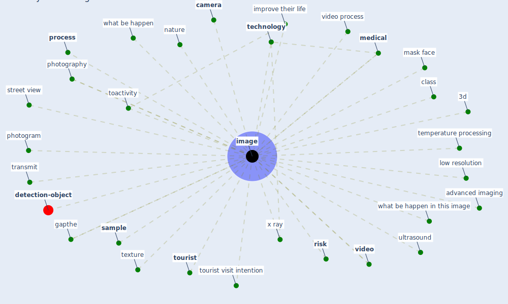

# Keyword: image

* [detection-object](cluster_8)

## Keywords

 * 3d, Cluster_8, advance, advanced imaging, [artificial intelligence](keyword_artificial_intelligence), brand equity, brand image, [camera](keyword_camera), chest x ray, [city](keyword_city), class, corporate, country image, country of origin, datum analytic, destination, face, gapthe, google street view, graph, grid cell, [image](keyword_image), image filter, image process, images, imaging, improve their life, low resolution, mask face, [medical](keyword_medical), [nature](keyword_nature), photogram, photography, [process](keyword_process), [risk](keyword_risk), [sample](keyword_sample), street view, [technology](keyword_technology), temperature processing, texture, toactivity, [tourist](keyword_tourist), tourist visit intention, transmit, ultrasound, [video](keyword_video), video process, what be happen, what be happen in this image, x ray

## Mapping

## Neighbours

### Closest articles

* DeepSOCIAL: Social Distancing Monitoring and Infection Risk Assessment in COVID-19 Pandemic - [LINK](article_rezaei_deepsocial_2020)
* A Mixed Approach on Resilience of Spanish Dwellings and Households during COVID-19 Lockdown - [LINK](article_cuerdo-vilches_mixed_2020)
* How COVID-19 Could Accelerate the Adoption of New Retail Technologies and Enhance the (E-)Servicescape - [LINK](article_willems_how_2021)
*  - [LINK](article_huy-tran_design_2022)
* Seeing the invisible hand: Underlying effects of COVID-19 on tourists’ behavioral patterns - [LINK](article_li_seeing_2020)
* Designing a Multi-Agent Occupant Simulation System to Support Facility Planning and Analysis for COVID-19 - [LINK](article_lee_designing_2021)
* An Automated System to Limit COVID-19 Using Facial Mask Detection in Smart City Network - [LINK](article_rahman_automated_2020)
* A Comprehensive Review of the COVID-19 Pandemic and the Role of IoT, Drones, AI, Blockchain, and 5G in Managing its Impact - [LINK](article_chamola_comprehensive_2020)
* Mobile Technology Solution for COVID-19: Surveillance and Prevention - [LINK](article_raza_mobile_2021)
* Telehealth overpromises during the Covid-19 pandemic - [LINK](article_ostherr_telehealth_2020)

### Closest BPs

