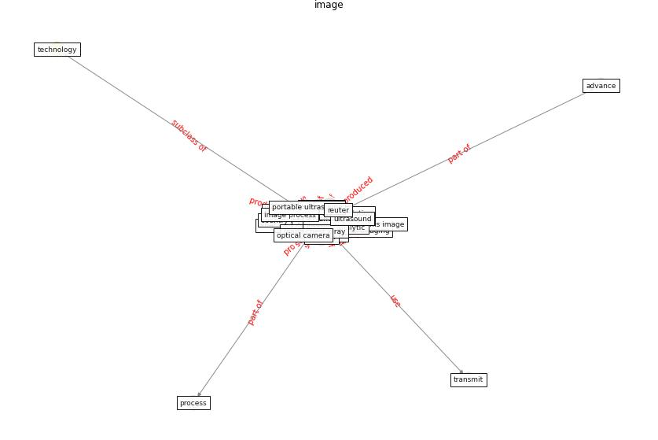

# Keyword: __image__
## Clusters

* Cluster 1: [om-ai](cluster_1)

## Concepts

 

## Articles
* Using Technology to Maintain the Education of
Residents During the COVID-19 Pandemic ([chick_using_2020](article_chick_using_2020))
* A Mixed Approach on Resilience of Spanish
Dwellings and Households during COVID-19 Lockdown ([cuerdo-vilches_mixed_2020](article_cuerdo-vilches_mixed_2020))
* A Mixed Approach on Resilience of Spanish
Dwellings and Households during COVID-19 Lockdown ([cuerdo-vilches_mixed_2020](article_cuerdo-vilches_mixed_2020))
* p15-lee-vor-500 ([p15-lee-vor-500](article_p15-lee-vor-500))
* ostherr_telehealth_2020-0 ([ostherr_telehealth_2020-0](article_ostherr_telehealth_2020-0))
* realdania_refleksioner_2022_EN-1900 ([realdania_refleksioner_2022_EN-1900](article_realdania_refleksioner_2022_EN-1900))
* A Comprehensive Review of the COVID-19 Pandemic
and the Role of IoT, Drones, AI, Blockchain, and
5G in Managing its Impact ([chamola_comprehensive_2020](article_chamola_comprehensive_2020))
* Exploring the Potential of Artificial Intelligence
and Machine Learning to Combat COVID-19 and
Existing Opportunities for LMIC: A Scoping
Review ([naseem_exploring_2020](article_naseem_exploring_2020))
* Impact of COVID-19 on IoT Adoption in Healthcare,
Smart Homes, Smart Buildings, Smart Cities,
Transportation and Industrial IoT ([umair_impact_2021](article_umair_impact_2021))
* DeepSOCIAL: Social Distancing Monitoring and
Infection Risk Assessment in COVID-19 Pandemic ([rezaei_deepsocial_2020](article_rezaei_deepsocial_2020))
