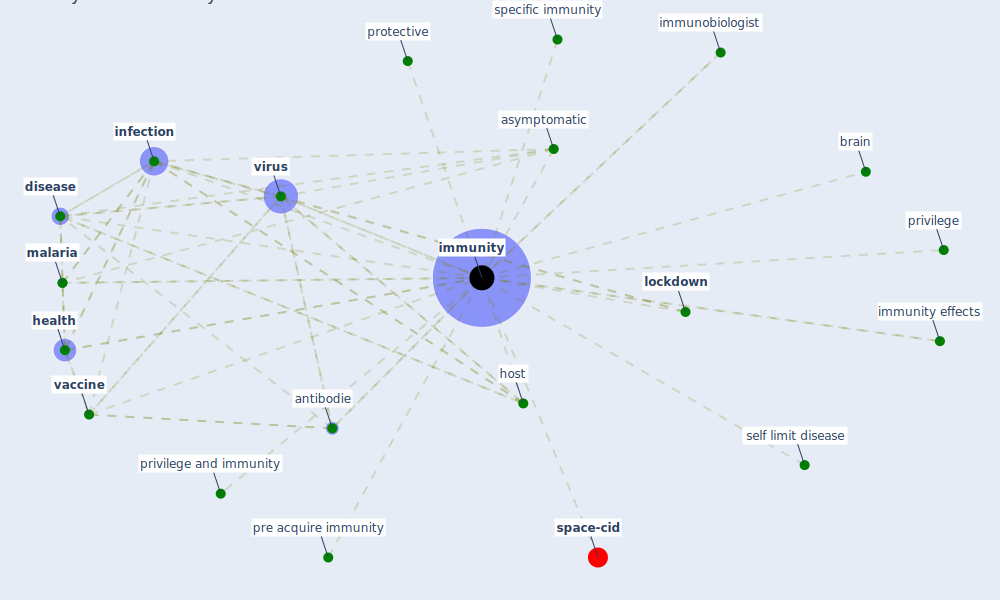

# Keyword: immunity

* [space-cid](cluster_2)

## Keywords

 * Cluster_2, antibodie, asymptomatic, brain, [disease](keyword_disease), [health](keyword_health), host, immunities, [immunity](keyword_immunity), immunity effects, immunobiologist, [infection](keyword_infection), [lockdown](keyword_lockdown), [malaria](keyword_malaria), pre acquire immunity, privilege, privilege and immunity, protective, self limit disease, specific immunity, [vaccine](keyword_vaccine), [virus](keyword_virus)

## Mapping

## Neighbours

### Closest articles

* Effects of temperature and humidity on the spread of COVID-19: A systematic review - [LINK](article_mecenas_effects_2020)
* ASHRAE Position Document on Infectious Aerosols - [LINK](article_ashrae_ashrae_2022)
* Decision Making within the Built Environment as a Strategy for Mitigating the Risk of Malaria and Other Vector-Borne Diseases - [LINK](article_obonyo_decision_2018)
* Integrating rapid risk mapping and mobile phone call record data for strategic malaria elimination planning - [LINK](article_tatem_integrating_2014)
* Nurture to nature via COVID-19, a self-regenerating environmental strategy of environment in global context - [LINK](article_paital_nurture_2020)
* The contribution of green buildings in the fight against COVID-19 - [LINK](article_world_green_building_council_contribution_2020)
*  - [LINK](article_yakubu_aminu_dodo_green_2020)
* 2020 Data Protection Report - [LINK](article_council_of_europe_2020_2020)
* World Bank Development Report - [LINK](article_world_bank_world_2022)
* Impact of Covid-19 on the built environment - [LINK](article_mahima_impact_2022)

### Closest BPs

