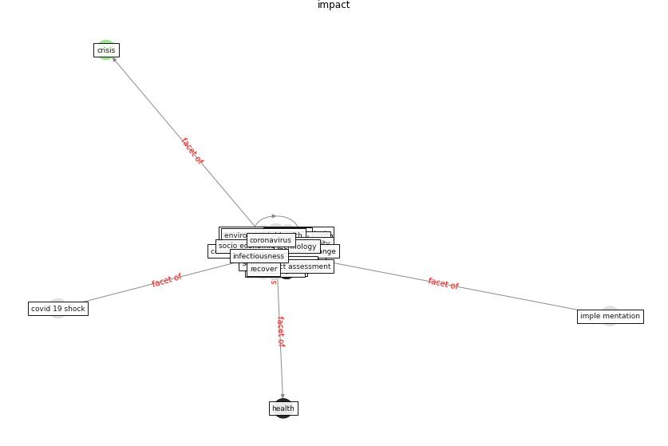

# Keyword: __impact__
## Clusters

* Cluster 3: [construction-project](cluster_3)
* Cluster 4: [resilience-health](cluster_4)

## Concepts

 

## Top 10 articles for __impact__
* Influence between COVID-19 Impacts and Project
Stakeholders in Chilean Construction Projects ([araya_influence_2021](article_araya_influence_2021))
* Assessment of Building Automation and Control
Systems in Danish Healthcare Facilities in the
COVID-19 Era ([pedersen_assessment_2022](article_pedersen_assessment_2022))
* The COVID-19 pandemic: Impacts on cities and major
lessons for urban planning, design, and management ([sharifi_covid-19_2020](article_sharifi_covid-19_2020))
* world_green_building_council_health_2014 ([world_green_building_council_health_2014](article_world_green_building_council_health_2014))
* rtpi_urban_2021 ([rtpi_urban_2021](article_rtpi_urban_2021))
* COVID-19 and Green Housing: A Review of
Relevant Literature ([kaklauskas_covid-19_2021](article_kaklauskas_covid-19_2021))
* Strategies to Mitigate COVID-19 Pandemic Impacts
on Health and Safety of Workers in Construction
Projects ([kaushal_strategies_2021](article_kaushal_strategies_2021))
* Navigating Climate Change: Rethinking the Role of
Buildings ([cole_navigating_2020](article_cole_navigating_2020))
* The Impact of Pandemic Crisis on the Survival of
Construction Industry: A Case of COVID-19 ([gamil_impact_2020](article_gamil_impact_2020))
* COVID-19 Could Leverage a Sustainable Built
Environment ([pinheiro_covid-19_2020](article_pinheiro_covid-19_2020))
