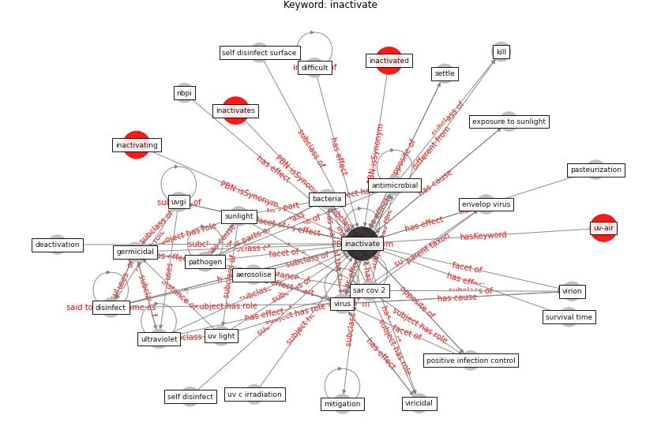

# Keyword: inactivate

* [uv-air](cluster_Cluster_4)

## Keywords

 * Cluster_4, [aerosol](keyword_aerosol), aerosolise, [antimicrobial](keyword_antimicrobial), [bacteria](keyword_bacteria), chemical, deactivation, difficult, disinfect, [disinfectant](keyword_disinfectant), envelop virus, exposure to simulate sunlight, exposure to sunlight, far uvc light, [germicidal](keyword_germicidal), heat inactivation, [inactivate](keyword_inactivate), inactivated, inactivates, inactivating, infectivity, kill, [microorganism](keyword_microorganism), [mitigation](keyword_mitigation), nbpi, pasteurization, [pathogen](keyword_pathogen), positive infection control, [sar cov 2](keyword_sar_cov_2), self disinfect, self disinfect surface, settle, sunlight, survival time, [ultraviolet](keyword_ultraviolet), uv c irradiation, [uv light](keyword_uv_light), [uvgi](keyword_uvgi), viricidal, virion, [virus](keyword_virus)

## Concepts

 

## Neighbours

### Closest articles

* Applications of ultraviolet germicidal irradiation disinfection in health care facilities: Effective adjunct, but not stand-alone technology - [LINK](article_memarzadeh_applications_2010)
* Review and comparison of HVAC operation guidelines in different countries during the COVID-19 pandemic - [LINK](article_guo_review_2021)
* Upper-room ultraviolet air disinfection might help to reduce COVID-19 transmission in buildings: a feasibility study - [LINK](article_beggs_upper-room_2020)
* Environmental factors involved in SARS-CoV-2 transmission: effect and role of indoor environmental quality in the strategy for COVID-19 infection control - [LINK](article_azuma_environmental_2020)
* Sars-CoV-2 (COVID-19) inactivation capability of copper-coated touch surface fabricated by cold-spray technology - [LINK](article_hutasoit_sars-cov-2_2020)
* Methods for air cleaning and protection of building occupants from airborne pathogens - [LINK](article_bolashikov_methods_2009)
* Designing Post COVID-19 Buildings: Approaches for Achieving Healthy Buildings - [LINK](article_navaratnam_designing_2022)
* The effect of occupant distribution on energy consumption and COVID-19 infection in buildings: A case study of university building - [LINK](article_mokhtari_effect_2021)
* Effect of Ultraviolet Germicidal Irradiation on Viral Aerosols - [LINK](article_walker_effect_2007)
* Graphene-based nanomaterials as antimicrobial surface coatings: A parallel approach to restrain the expansion of COVID-19 - [LINK](article_ayub_graphene-based_2021)

### Closest BPs

