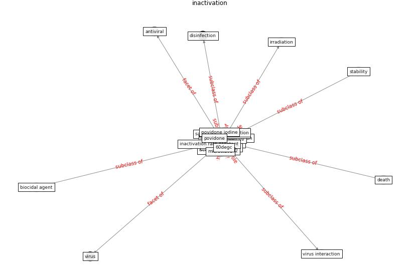

# Keyword: __inactivation__
## Clusters

* Cluster 2: [uv-room](cluster_2)
* Cluster 5: [uvc-hcov](cluster_5)

## Concepts

 

## Top 10 articles for __inactivation__
* Effect of Ultraviolet Germicidal Irradiation on
Viral Aerosols ([walker_effect_2007](article_walker_effect_2007))
* Graphene-based nanomaterials as antimicrobial surface
coatings: A parallel approach to restrain the expansion
of COVID-19 ([ayub_graphene-based_2021](article_ayub_graphene-based_2021))
* Upper-room ultraviolet air disinfection might help to
reduce COVID-19 transmission in buildings: a feasibility
study ([beggs_upper-room_2020](article_beggs_upper-room_2020))
* Disinfection technology of hospital wastes and wastewater:
Suggestions for disinfection strategy during coronavirus
Disease 2019 (COVID-19) pandemic in China ([wang_disinfection_2020](article_wang_disinfection_2020))
* Mechanistic insights into the effect of humidity on
airborne influenza virus survival, transmission and
incidence ([marr_mechanistic_2019](article_marr_mechanistic_2019))
* An environmental and health perspective for COVID-19
outbreak: Meteorology and air quality influence, sewage
epidemiology indicator, hospitals disinfection, drug
therapies and recommendations ([barcelo_environmental_2020](article_barcelo_environmental_2020))
* 2019 Novel Coronavirus (COVID-19) Pandemic:
Built Environment Considerations To Reduce
Transmission ([dietz_2019_2020](article_dietz_2019_2020))
* Applications of ultraviolet germicidal irradiation
disinfection in health care facilities: Effective
adjunct, but not stand-alone technology ([memarzadeh_applications_2010](article_memarzadeh_applications_2010))
* Persistence of coronaviruses on inanimate surfaces and
their inactivation with biocidal agents ([kampf_persistence_2020](article_kampf_persistence_2020))
* First detection of SARS-CoV-2 in untreated wastewaters
in Italy ([la_rosa_first_2020](article_la_rosa_first_2020))
