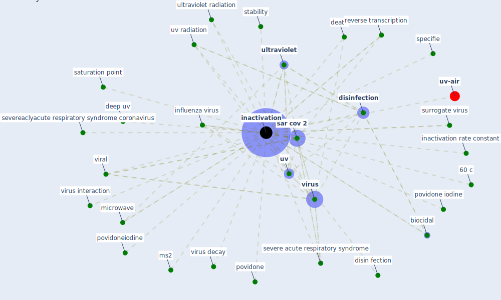

# Keyword: inactivation

* [uv-air](cluster_15)

## Keywords

 * 60 c, Cluster_15, SARS-CoV-2, age, [antiviral](keyword_antiviral), as deposit, biocidal, casanova, death, decay, deep uv, deep uv lead, disin fection, disinfect, [disinfection](keyword_disinfection), [inactivation](keyword_inactivation), inactivation of influenza virus, inactivation rate constant, [influenza virus](keyword_influenza_virus), [irradiation](keyword_irradiation), mhv coronavirus, microwave, mj cm2, ms2, noroviru, povidone, povidone iodine, povidoneiodine, reverse transcription, [sar cov 2](keyword_sar_cov_2), saturation point, severe acute respiratory syndrome, severeaclyacute respiratory syndrome coronavirus, specifie, stability, surrogate virus, [ultraviolet](keyword_ultraviolet), ultraviolet radiation, [uv](keyword_uv), uv radiation, [viral](keyword_viral), [virus](keyword_virus), virus decay, virus interaction

## Mapping

## Neighbours

### Closest articles

* Effect of Ultraviolet Germicidal Irradiation on Viral Aerosols - [LINK](article_walker_effect_2007)
* Graphene-based nanomaterials as antimicrobial surface coatings: A parallel approach to restrain the expansion of COVID-19 - [LINK](article_ayub_graphene-based_2021)
* Upper-room ultraviolet air disinfection might help to reduce COVID-19 transmission in buildings: a feasibility study - [LINK](article_beggs_upper-room_2020)
* Disinfection technology of hospital wastes and wastewater: Suggestions for disinfection strategy during coronavirus Disease 2019 (COVID-19) pandemic in China - [LINK](article_wang_disinfection_2020)
* Mechanistic insights into the effect of humidity on airborne influenza virus survival, transmission and incidence - [LINK](article_marr_mechanistic_2019)
* Applications of ultraviolet germicidal irradiation disinfection in health care facilities: Effective adjunct, but not stand-alone technology - [LINK](article_memarzadeh_applications_2010)
* An environmental and health perspective for COVID-19 outbreak: Meteorology and air quality influence, sewage epidemiology indicator, hospitals disinfection, drug therapies and recommendations - [LINK](article_barcelo_environmental_2020)
* Persistence of coronaviruses on inanimate surfaces and their inactivation with biocidal agents - [LINK](article_kampf_persistence_2020)
* A critical review of heating, ventilation, and air conditioning (HVAC) systems within the context of a global SARS-CoV-2 epidemic - [LINK](article_elsaid_critical_2021)
* SARS-CoV-2 RNA in wastewater anticipated COVID-19 occurrence in a low prevalence area - [LINK](article_randazzo_sars-cov-2_2020)

### Closest BPs

