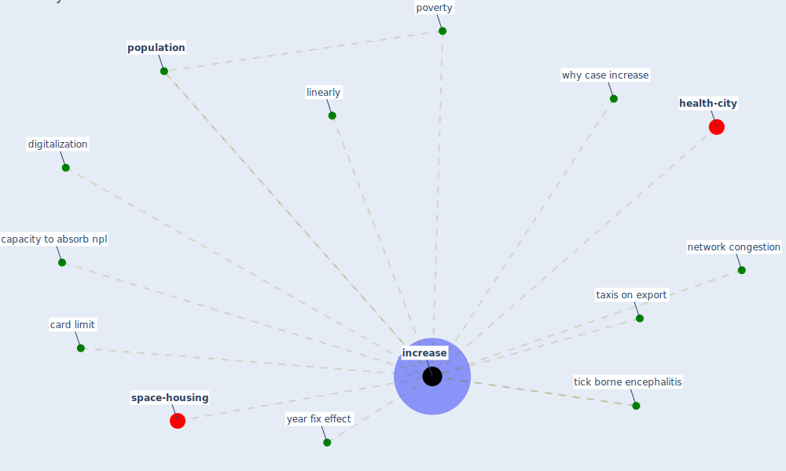

# Keyword: increase

* [health-city](cluster_1)

* [space-housing](cluster_4)

## Keywords

 * Cluster_1, Cluster_4, capacity to absorb npl, card limit, digitalization, [increase](keyword_increase), increased, increasing, linearly, network congestion, [population](keyword_population), poverty, taxis on export, tick borne encephalitis, why case increase, year fix effect

## Mapping

## Neighbours

### Closest articles

* World Bank Development Report - [LINK](article_world_bank_world_2022)
* Making green infrastructure healthier infrastructure - [LINK](article_lohmus_making_2015)
* Decision Making within the Built Environment as a Strategy for Mitigating the Risk of Malaria and Other Vector-Borne Diseases - [LINK](article_obonyo_decision_2018)
* How COVID-19 Could Accelerate the Adoption of New Retail Technologies and Enhance the (E-)Servicescape - [LINK](article_willems_how_2021)
* Urban design attributes and resilience: COVID-19 evidence from New York City - [LINK](article_yang_urban_2021)
* COVID-19 and the rise of intimate partner violence - [LINK](article_aguero_covid-19_2021)
* EXPOSED: An occupant exposure model for confined spaces to retrofit crowd models during a pandemic - [LINK](article_ronchi_exposed_2020)
* COVID-19: IMPACT OF THE PANDEMIC ON THE SUSTAINABLE DEVELOPMENT GOALS - [LINK](article_samout_covid-19_2020)
* The role of 5G for digital healthcare against COVID-19 pandemic: Opportunities and challenges - [LINK](article_siriwardhana_role_2021)

### Closest BPs

