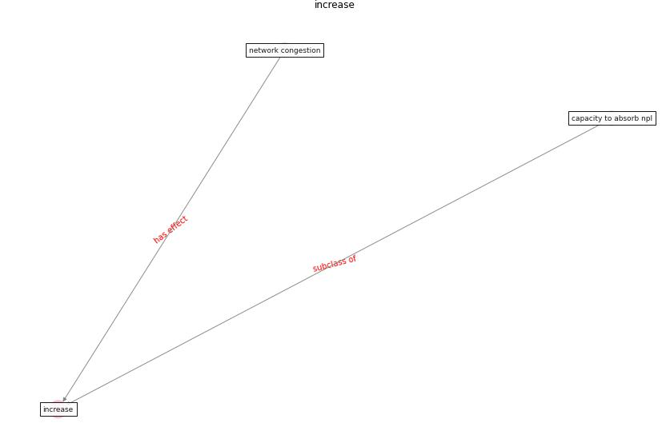

# Keyword: __increase__
## Clusters

* Cluster 10: [fake-medium](cluster_10)

## Concepts

 

## Articles
* world_bank_world_2022-250 ([world_bank_world_2022-250](article_world_bank_world_2022-250))
* The role of 5G for digital healthcare against COVID-19
pandemic: Opportunities and challenges ([siriwardhana_role_2021](article_siriwardhana_role_2021))
* RUDDS_bioRxiv_update-0 ([RUDDS_bioRxiv_update-0](article_RUDDS_bioRxiv_update-0))
* realdania_refleksioner_2022_EN-1150 ([realdania_refleksioner_2022_EN-1150](article_realdania_refleksioner_2022_EN-1150))
* realdania_refleksioner_2022_EN-1450 ([realdania_refleksioner_2022_EN-1450](article_realdania_refleksioner_2022_EN-1450))
* realdania_refleksioner_2022_EN-1400 ([realdania_refleksioner_2022_EN-1400](article_realdania_refleksioner_2022_EN-1400))
* realdania_refleksioner_2022_EN-1350 ([realdania_refleksioner_2022_EN-1350](article_realdania_refleksioner_2022_EN-1350))
* realdania_refleksioner_2022_EN-1300 ([realdania_refleksioner_2022_EN-1300](article_realdania_refleksioner_2022_EN-1300))
* realdania_refleksioner_2022_EN-1250 ([realdania_refleksioner_2022_EN-1250](article_realdania_refleksioner_2022_EN-1250))
* realdania_refleksioner_2022_EN-1200 ([realdania_refleksioner_2022_EN-1200](article_realdania_refleksioner_2022_EN-1200))
