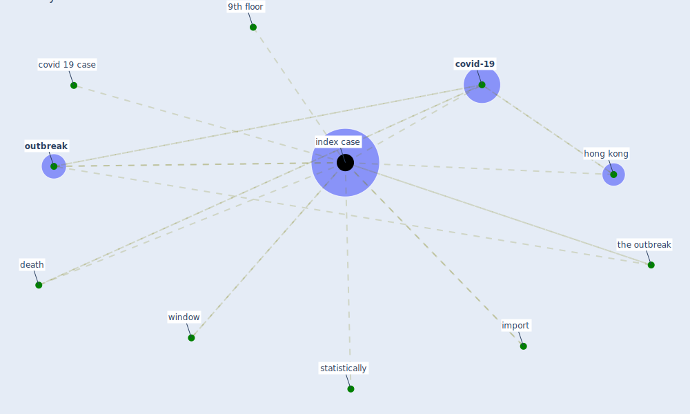

# Keyword: index case

## Keywords

 * 9th floor, covid 19 case, [covid-19](keyword_covid-19), death, [hong kong](keyword_hong_kong), import, [index case](keyword_index_case), [outbreak](keyword_outbreak), statistically, the outbreak, [window](keyword_window)

## Mapping

## Neighbours

### Closest articles

* Heating, ventilation and air-conditioning systems in the context of COVID-19 - [LINK](article_ecdc_heating_2020)
* COVID-19 risks and systemic gaps in Nigeria: resilience building lessons for pandemic and climate change management - [LINK](article_lawal_covid-19_2022)
* A Surface Coating that Rapidly Inactivates SARS-CoV-2 - [LINK](article_behzadinasab_surface_2020)

### Closest BPs

