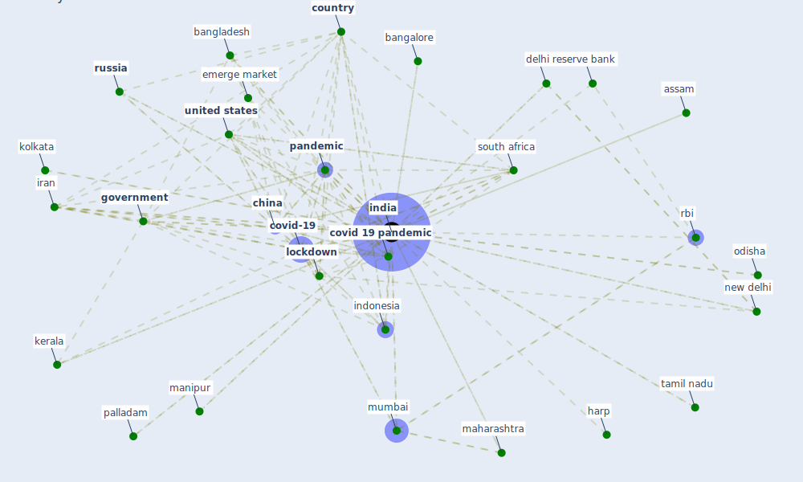

# Keyword: india

## Keywords

 * aarogya setu, aarogya setu app, ahmedabad, andhra pradesh, ashoka university, assam, [australia](keyword_australia), bangalore, bangladesh, banking system, bhopal, bhubaneswar, chandigarh, chennai, [china](keyword_china), [chinese](keyword_chinese), construction sector, [coronavirus](keyword_coronavirus), [country](keyword_country), covid 19 lockdown, covid 19 outbreak, [covid 19 pandemic](keyword_covid_19_pandemic), [covid-19](keyword_covid-19), covid19 pandemic, delhi, develop country, district, [economy](keyword_economy), elangana, emerge market, [energy consumption](keyword_energy_consumption), european, european country, first wave of the pandemic, [france](keyword_france), g20 nation, global, goi, [government](keyword_government), government of india, harp, haryana, hyderabad, [india](keyword_india), india today, indian government, indian institute of management, indian prime minister, [indonesia](keyword_indonesia), iran, [italy](keyword_italy), [kerala](keyword_kerala), kolkata, [lockdown](keyword_lockdown), lucknow, lung, maharashtra, [manipur](keyword_manipur), mass migration, middle income country, ministry of electronics and information technology, mumbai, new delhi, northern india, odisha, ontario, orissa, pakistan, palladam, [pandemic](keyword_pandemic), pandemic smart city, [personal protective equipment](keyword_personal_protective_equipment), press information bureau, pune, quarantine watch, quarantinewatch, rbi, republic of korea, reserve bank, reserve bank of india, rteict, rural, [russia](keyword_russia), sangeet natak akademi award, seha, singapore, soulace11, [south africa](keyword_south_africa), south asia, [state](keyword_state), state government, [switzerland](keyword_switzerland), tamil nadu, tepeshpalayam, tuticorin, udaipur, [united kingdom](keyword_united_kingdom), [united states](keyword_united_states), university of delhi, uttarakhand

## Mapping

## Neighbours

### Closest articles

* World Bank Development Report - [LINK](article_world_bank_world_2022)
* A Comprehensive Review of the COVID-19 Pandemic and the Role of IoT, Drones, AI, Blockchain, and 5G in Managing its Impact - [LINK](article_chamola_comprehensive_2020)
* Nurture to nature via COVID-19, a self-regenerating environmental strategy of environment in global context - [LINK](article_paital_nurture_2020)
* Pandemic Analytics: How Countries are Leveraging Big Data Analytics and Artificial Intelligence to Fight COVID-19? - [LINK](article_mehta_pandemic_2021)
* Mobile Technology Solution for COVID-19: Surveillance and Prevention - [LINK](article_raza_mobile_2021)
* The three modes of existence of the pandemic smart city - [LINK](article_soderstrom_three_2021)
* A comprehensive review on indoor air quality monitoring systems for enhanced public health - [LINK](article_saini_comprehensive_2020)
* Health, Economic and Social Development Challenges of the COVID-19 Pandemic: Strategies for Multiple and Interconnected Issues - [LINK](article_panneer_health_2022)
* Overcoming the Impact of COVID-19 Using Integrated Project Delivery Model - [LINK](article_g_overcoming_2020)
* Learning from pandemics: Applying resilience thinking to identify priorities for planning urban settlements - [LINK](article_syal_learning_2021)

### Closest BPs

