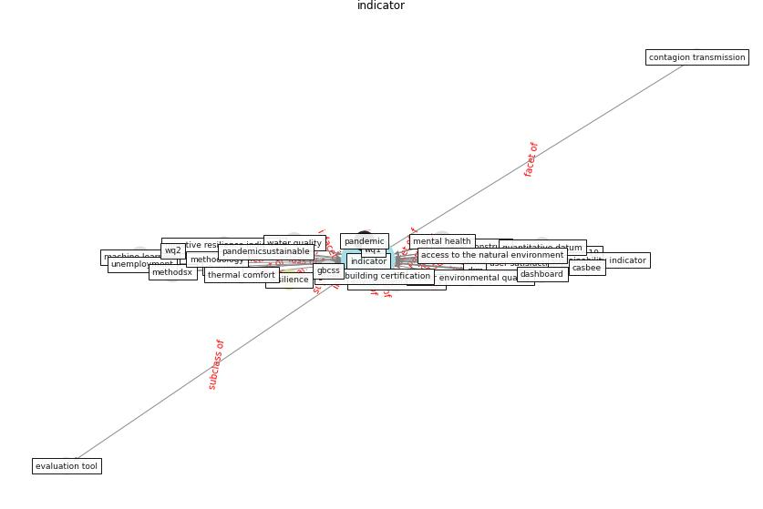

# Keyword: __indicator__
## Clusters

* Cluster 15: [building-green](cluster_15)

## Concepts

 

## Articles
* Readiness Assessment of Green Building
Certification Systems for Residential Buildings
during Pandemics ([tleuken_readiness_2021](article_tleuken_readiness_2021))
* Assessment method for new sustainability indicators
providing pandemic resilience for residential buildings ([tokazhanov_assessment_2021](article_tokazhanov_assessment_2021))
* oecd_guidelines_2014 ([oecd_guidelines_2014](article_oecd_guidelines_2014))
* A review of definitions and measures of system
resilience ([hosseini_review_2016](article_hosseini_review_2016))
* Smart cities and a data-driven response to COVID-19 ([james_smart_2020](article_james_smart_2020))
* eurofund_sustainable_2016 ([eurofund_sustainable_2016](article_eurofund_sustainable_2016))
* SARS-CoV-2 Titers in Wastewater Are Higher
than Expected from Clinically Confirmed Cases ([wu_sars-cov-2_2020](article_wu_sars-cov-2_2020))
* Prophylactic Architecture: Formulating the Concept
of Pandemic-Resilient Homes ([elrayies_prophylactic_2022](article_elrayies_prophylactic_2022))
* afrin_covid-19_2021 ([afrin_covid-19_2021](article_afrin_covid-19_2021))
* How to Make Green Building Certification \&
Rating Systems More Pandemic-Sustainable? ([ujikawa_how_2022](article_ujikawa_how_2022))
