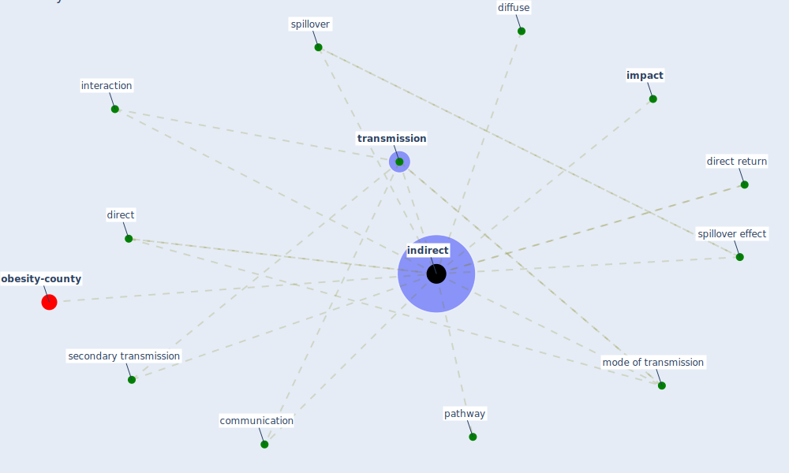

# Keyword: indirect

* [obesity-county](cluster_9)

## Keywords

 * Cluster_9, communication, diffuse, direct, direct return, [impact](keyword_impact), [indirect](keyword_indirect), [interaction](keyword_interaction), mode of transmission, pathway, secondary transmission, spillover, [spillover effect](keyword_spillover_effect), [transmission](keyword_transmission)

## Mapping

## Neighbours

### Closest articles

* COVID-19 and its Modes of Transmission - [LINK](article_karia_covid-19_2020)
* World Bank Development Report - [LINK](article_world_bank_world_2022)
* Association of built environment attributes with the spread of COVID-19 at its initial stage in China - [LINK](article_li_association_2021)
* How COVID-19 Could Accelerate the Adoption of New Retail Technologies and Enhance the (E-)Servicescape - [LINK](article_willems_how_2021)
* The socio-economic determinants of COVID-19: A spatial analysis of German county level data - [LINK](article_ehlert_socio-economic_2021)
* Prototype Early Warning Systems for Vector-Borne Diseases in Europe - [LINK](article_semenza_prototype_2015)
* Impacts of COVID-19 on Health and Safety of Workforce in Construction Industry - [LINK](article_pamidimukkala_impacts_2021)
* Effects of temperature and humidity on the spread of COVID-19: A systematic review - [LINK](article_mecenas_effects_2020)
* Indirect effects of COVID-19 on the environment - [LINK](article_zambrano-monserrate_indirect_2020)

### Closest BPs

