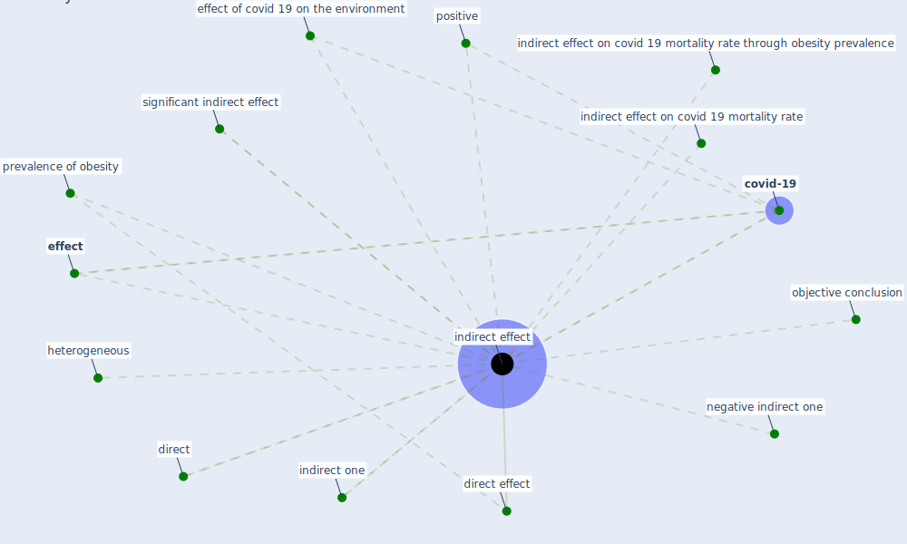

# Keyword: indirect effect

## Keywords

 * [covid-19](keyword_covid-19), direct, direct effect, [effect](keyword_effect), effect of covid 19 on the environment, heterogeneous, [indirect effect](keyword_indirect_effect), indirect effect on covid 19 mortality rate, indirect effect on covid 19 mortality rate through obesity prevalence, indirect effects, indirect one, negative indirect one, objective conclusion, positive, prevalence of obesity, significant indirect effect

## Mapping

## Neighbours

### Closest articles

* Treating two pandemics for the price of one: Chronic and infectious disease impacts of the built and natural environment - [LINK](article_frank_treating_2021)
* Indirect effects of COVID-19 on the environment - [LINK](article_zambrano-monserrate_indirect_2020)
* The socio-economic determinants of COVID-19: A spatial analysis of German county level data - [LINK](article_ehlert_socio-economic_2021)
* A critical analysis of the impacts of COVID-19 on the global economy and ecosystems and opportunities for circular economy strategies - [LINK](article_ibn-mohammed_critical_2021)
* Assessment method for new sustainability indicators providing pandemic resilience for residential buildings - [LINK](article_tokazhanov_assessment_2021)

### Closest BPs

