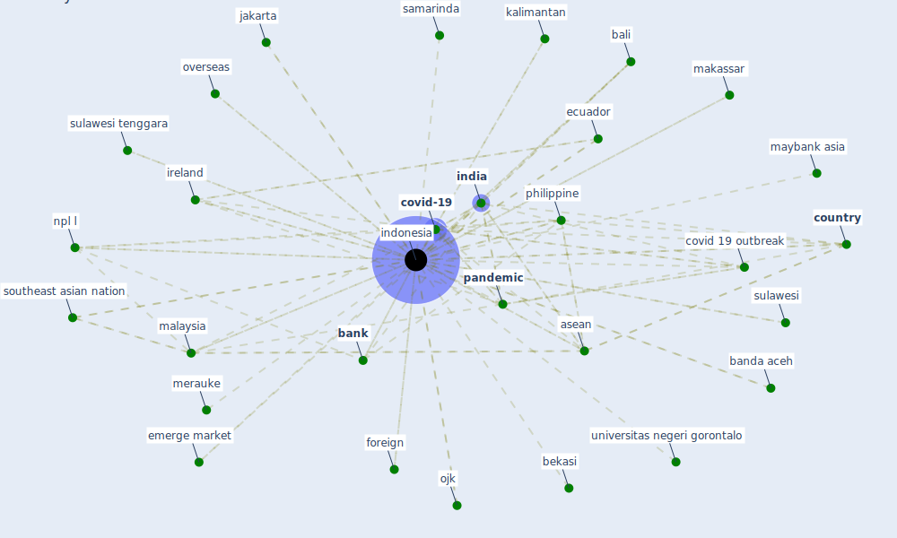

# Keyword: indonesia

## Keywords

 * aceh, [asean](keyword_asean), asia, asian country, bali, banda aceh, [bank](keyword_bank), bank bailout, bank banten, bank mandiri, bekasi, bengali, bojonegoro, bojonegoro district, budget deficit limit, budget deficit limit of 3 percent, case of covid 19, competition, coronavirus disease, coronavirus disease 19, [country](keyword_country), country in the world, covid 19 case, covid 19 case in indonesia, covid 19 in indonesia, covid 19 outbreak, covid 19 outbreak management, covid 19 virus, [covid-19](keyword_covid-19), e wallet, east jawa, economic study, ecuador, emerge market, first cases, foreign, hanoi, health coronavirus indonesia, ilmu kesehatan maranatha kupang, [india](keyword_india), [indonesia](keyword_indonesia), indonesia s, indonesian, indonesian government, indonesian rupiah, ireland, j sahar, jakarta, kalimantan, kolaka, lockdown enforcement, makassar, malawi, [malaysia](keyword_malaysia), maybank asia, merauke, news eng, news itu, north sumatera, npl l, ojk, overseas, [pandemic](keyword_pandemic), pca technique, philippine, [policy](keyword_policy), regulatory forbearance, [resident](keyword_resident), sabang, samarinda, sekolah tinggi, small and medium enterprise, sonangol, south sulawesi, southeast asia, southeast asian nation, sulawesi, sulawesi tenggara, sumatera, sumatera province, sumbar bukittinggi, sustainable bond, tabel, tabel 3, tahuna, task force for the acceleration of handle covid 19, team europe, uk108, unicef, united arab emirates, [united kingdom](keyword_united_kingdom), universitas negeri gorontalo, universitas syiah kuala, unmak, west jawa, wirawan, yarsi sumbar bukittinggi, yodang yodang, yogyakarta, yogyakarta province

## Mapping

## Neighbours

### Closest articles

* Knowledge, attitudes, and practices of Indonesian residents regarding COVID-19: A national cross-sectional survey - [LINK](article_yodang_knowledge_2021)
* COVID-19 and regional solutions for mitigating the risk of SME finance in selected ASEAN member states - [LINK](article_taghizadeh-hesary_covid-19_2022)
* World Bank Development Report - [LINK](article_world_bank_world_2022)
* Risk Diagnosis and Mitigation System of COVID-19 Using Expert System and Web Scraping - [LINK](article_mufid_risk_2020)
* Urban planning after COVID-19 - [LINK](article_rtpi_urban_2021)
* Housing Experience in Gated Communities in the Time of Pandemics: Lessons Learned from COVID-19 - [LINK](article_asfour_housing_2022)
* An environmental and health perspective for COVID-19 outbreak: Meteorology and air quality influence, sewage epidemiology indicator, hospitals disinfection, drug therapies and recommendations - [LINK](article_barcelo_environmental_2020)
* Learning from the COVID-19 pandemic in governing smart cities - [LINK](article_bolivar_learning_2022)
* The COVID-19 pandemic: Impacts on cities and major lessons for urban planning, design, and management - [LINK](article_sharifi_covid-19_2020)
* <scp>COVID</scp>             ‐19: Small and medium enterprises challenges and responses with creativity, innovation, and entrepreneurship - [LINK](article_thukral_covid19_2021)

### Closest BPs

