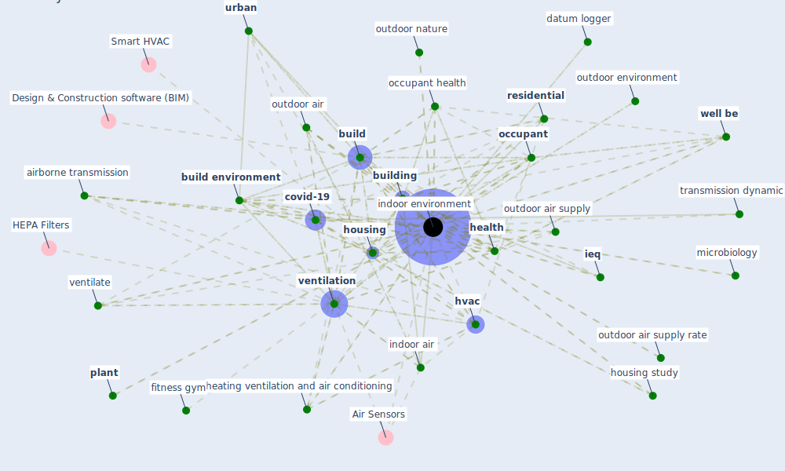

# Keyword: indoor environment

## Keywords

 * Air Sensors, [aerosol](keyword_aerosol), [air conditioning](keyword_air_conditioning), air quality, airborne microbe filtration, airborne transmission, aqi, behaviour, [biophilic](keyword_biophilic), [build](keyword_build), [build environment](keyword_build_environment), build form, [building](keyword_building), closed space, comfort, [covid-19](keyword_covid-19), datum logger, energy recovery ventilation, fitness gym, fresh air ventilation, [green](keyword_green), [green building](keyword_green_building), green toronto school, greenspace, guideline, [health](keyword_health), health condition, heating ventilation and air conditioning, [hospital](keyword_hospital), [housing](keyword_housing), housing study, human comfort, [human health](keyword_human_health), human walking, humanhealth, [hvac](keyword_hvac), [hvac system](keyword_hvac_system), [iaq](keyword_iaq), [ieq](keyword_ieq), indoor air, [indoor air quality](keyword_indoor_air_quality), indoor air quality iaq, [indoor environment](keyword_indoor_environment), indoor environments, indoor space, infection risk management, [infectious disease](keyword_infectious_disease), labbe, localization, lockdown state, measurement, microbiology, minimum ventilation rate, [occupancy](keyword_occupancy), [occupant](keyword_occupant), [occupant health](keyword_occupant_health), occupant well be, outdoor air, outdoor air supply, outdoor air supply rate, outdoor environment, outdoor nature, particle matter, [plant](keyword_plant), plant life, [public place](keyword_public_place), quality of living, [residential](keyword_residential), safe, sanitary, sanitary condition, [space](keyword_space), spread of infection, [technology](keyword_technology), training technique, [transmission](keyword_transmission), transmission dynamic, [urban](keyword_urban), ventilate, [ventilation](keyword_ventilation), ventilation rate, walk, [well be](keyword_well_be), [window](keyword_window), year round air conditioning

## Mapping

## Neighbours

### Closest articles

* The ventilation of buildings and other mitigating measures for COVID-19: a focus on wintertime - [LINK](article_burridge_ventilation_2021)
* Indoor Air Quality: Rethinking rules of building design strategies in post-pandemic architecture - [LINK](article_megahed_indoor_2021)
* Continuous IEQ monitoring system: Context and development - [LINK](article_parkinson_continuous_2019)
* A critical review of heating, ventilation, and air conditioning (HVAC) systems within the context of a global SARS-CoV-2 epidemic - [LINK](article_elsaid_critical_2021)
* Reflecting on Impacts of COVID19 on Sustainable Buildings and Cities - [LINK](article_gonzalez_reflecting_2021)
* Environmental factors involved in SARS-CoV-2 transmission: effect and role of indoor environmental quality in the strategy for COVID-19 infection control - [LINK](article_azuma_environmental_2020)
* COVID-19 and Green Housing: A Review of Relevant Literature - [LINK](article_kaklauskas_covid-19_2021)
* Occupant health in buildings: Impact of the COVID-19 pandemic on the opinions of building professionals and implications on research - [LINK](article_awada_occupant_2022)
* Designing Post COVID-19 Buildings: Approaches for Achieving Healthy Buildings - [LINK](article_navaratnam_designing_2022)
* A comprehensive review on indoor air quality monitoring systems for enhanced public health - [LINK](article_saini_comprehensive_2020)

### Closest BPs

