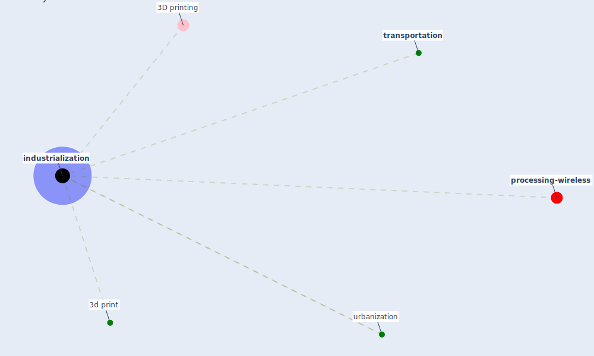

# Keyword: industrialization

* [processing-wireless](cluster_14)

## Keywords

 * 3D printing, [3d print](keyword_3d_print), Cluster_14, [industrialization](keyword_industrialization), [transportation](keyword_transportation), urbanization

## Mapping

## Neighbours

### Closest articles

* A critical analysis of the impacts of COVID-19 on the global economy and ecosystems and opportunities for circular economy strategies - [LINK](article_ibn-mohammed_critical_2021)
* Propositions for a Resilient, Post-COVID-19 Future for the AEC Industry - [LINK](article_nassereddine_propositions_2021)
* Nurture to nature via COVID-19, a self-regenerating environmental strategy of environment in global context - [LINK](article_paital_nurture_2020)

### Closest BPs

