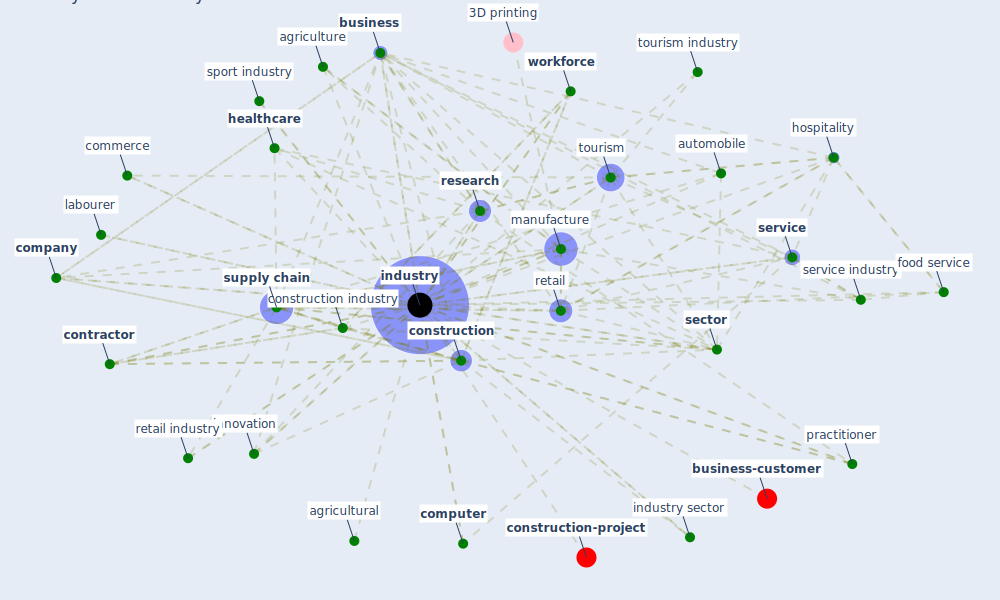

# Keyword: industry

* [construction-project](cluster_8)

* [business-customer](cluster_11)

## Keywords

 * academic research, actor, aec, agricultural, agriculture, airline, asset class, automation, automobile, aviation, banking, benefit, [build](keyword_build), build industry, [business](keyword_business), business development, business type, carbon intensive, carbon intensive fuel, casino, commerce, [company](keyword_company), [computer](keyword_computer), [construction](keyword_construction), [construction industry](keyword_construction_industry), construction technology, [contractor](keyword_contractor), cope strategy, corporation, [country](keyword_country), [covid-19](keyword_covid-19), deposit bank, deposit banking, disrupt industry, [domain](keyword_domain), [energy](keyword_energy), enterprise, entertainment, [entrepreneurship](keyword_entrepreneurship), essential, [facility management](keyword_facility_management), fitness, food service, geography, good practice, [health care](keyword_health_care), [healthcare](keyword_healthcare), hospitality, [household](keyword_household), [industry](keyword_industry), industry overall, industry sector, [infrastructure](keyword_infrastructure), [innovation](keyword_innovation), [iot](keyword_iot), knowledge economy, labour market participation, labourer, major and minor development change, [manufacture](keyword_manufacture), [market](keyword_market), market force, [marketing](keyword_marketing), mechanical, mobile app, [model](keyword_model), next challenge, notfor profit organization, [nursing](keyword_nursing), occupation, oil company, [policy](keyword_policy), post covid 19, practitioner, production, pulp and paper, [region](keyword_region), region of interest, [research](keyword_research), retail, retail industry, revenue, scholarly research, [sector](keyword_sector), [service](keyword_service), service industry, service provider, servicescape, small business, software, sport industry, [supply chain](keyword_supply_chain), [technology](keyword_technology), [tourism](keyword_tourism), tourism industry, tourist, trade, transaction, work routine, [workforce](keyword_workforce)

## Mapping

## Neighbours

### Closest articles

* How COVID-19 Could Accelerate the Adoption of New Retail Technologies and Enhance the (E-)Servicescape - [LINK](article_willems_how_2021)
* Guidelines for Responding to COVID-19 Pandemic: Best Practices, Impacts, and Future Research Directions - [LINK](article_assaad_guidelines_2021)
* Propositions for a Resilient, Post-COVID-19 Future for the AEC Industry - [LINK](article_nassereddine_propositions_2021)
* Mechanisms for addressing the impact of COVID-19 on infrastructure projects - [LINK](article_king_mechanisms_2021)
* COVID-19 pandemic: the effects and prospects in the construction industry. - [LINK](article_ogunnusi_covid-19_2020)
* Health, Wellbeing \& Productivity in Offices - [LINK](article_world_green_building_council_health_2014)
* World Bank Development Report - [LINK](article_world_bank_world_2022)
* Impact of COVID-19 on IoT Adoption in Healthcare, Smart Homes, Smart Buildings, Smart Cities, Transportation and Industrial IoT - [LINK](article_umair_impact_2021)
* Perception of COVID-19 impacts on the construction industry over time - [LINK](article_rokooei_perception_2022)
* Identifying Actions to Control and Mitigate the Effects of the COVID-19 Pandemic on Construction Organizations: Preliminary Findings - [LINK](article_raoufi_identifying_2021)

### Closest BPs

