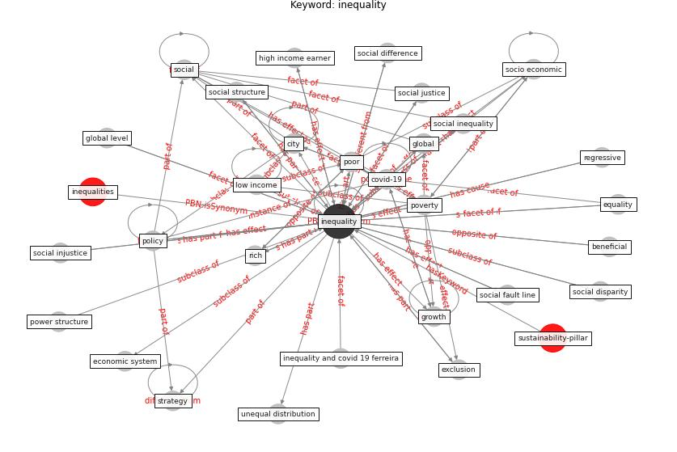

# Keyword: inequality

* [sustainability-pillar](cluster_Cluster_0)

## Keywords

 * Cluster_0, access to transport, beneficial, capitalism, [city](keyword_city), city level, class, corona crisis, [country](keyword_country), [covid 19 crisis](keyword_covid_19_crisis), covid 19 ferreira, [covid-19](keyword_covid-19), data poverty, discrimination, diversity, [economic](keyword_economic), economic system, equality, [europe](keyword_europe), europe s, exclusion, executive pay package, finance gap, [global](keyword_global), global level, global poverty, growth, harm, health inequity, healthcare access, high income earner, highly unequal, highly unequal within and between country, [homelessness](keyword_homelessness), human development, hyperinflation, [impact](keyword_impact), income, income group, inequalities, [inequality](keyword_inequality), inequality and covid 19 ferreira, inequality in the us, inequality of power relation, inflation, investment, labor force participation, [labour market](keyword_labour_market), long term, low income, macroeconomic, marginalise, neoliberalism, part time work arrangement, pattern, per capita gdp, [policy](keyword_policy), poor, poor adult, positionality, poverty, power structure, precarity, privilege, problem, problem that can be link to they, recession, redistributive power, regional, regressive, rich, [social](keyword_social), social determinant of health, social difference, social disconnect, social disparity, social fault line, social inequality, social injustice, social justice, social structure, social welfare, [society](keyword_society), socio economic, socio economic inequality, socioeconomic, socioeconomic landscape, [spread](keyword_spread), strategy, structural, structural inequality, the pandemic, unequal distribution, unequal distribution of urban green infrastructure, [urban](keyword_urban), urban inequality, urban poor, [vulnerability](keyword_vulnerability)

## Concepts

 

## Neighbours

### Closest articles

* World Bank Development Report - [LINK](article_world_bank_world_2022)
* Urban planning after COVID-19 - [LINK](article_rtpi_urban_2021)
* Dangerous liaisons? Applying the social harm perspective to the social inequality, housing and health trifecta during the Covid-19 pandemic - [LINK](article_gurney_dangerous_2021)
* The COVID-19 pandemic: Impacts on cities and major lessons for urban planning, design, and management - [LINK](article_sharifi_covid-19_2020)
* The COVID-19 pandemic: Lessons on building more equal and sustainable societies - [LINK](article_van_barneveld_covid-19_2020)
* COVID-19 risks and systemic gaps in Nigeria: resilience building lessons for pandemic and climate change management - [LINK](article_lawal_covid-19_2022)
* Urban Green Infrastructure and Green Open Spaces: An Issue of Social Fairness in Times of COVID-19 Crisis - [LINK](article_reinwald_urban_2021)
* A critical analysis of the impacts of COVID-19 on the global economy and ecosystems and opportunities for circular economy strategies - [LINK](article_ibn-mohammed_critical_2021)
* Validity of energy social research during and after COVID-19: challenges, considerations, and responses - [LINK](article_fell_validity_2020)
* COVID-19 and social inequalities: a complex and dynamic interaction - [LINK](article_quantin_covid-19_2022)

### Closest BPs

