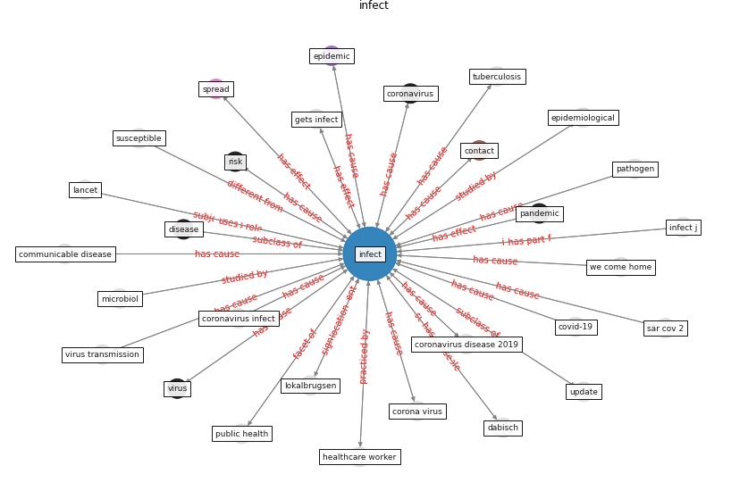

# Keyword: __infect__
## Clusters

* Cluster 0: [energy-building](cluster_0)

## Concepts

 

## Top 10 articles for __infect__
* A Comprehensive Review of the COVID-19 Pandemic
and the Role of IoT, Drones, AI, Blockchain, and
5G in Managing its Impact ([chamola_comprehensive_2020](article_chamola_comprehensive_2020))
* The effect of occupant distribution on energy consumption
and COVID-19 infection in buildings: A case study of
university building ([mokhtari_effect_2021](article_mokhtari_effect_2021))
* COVID-19 Prevention and Control Measures in
Workplace Settings: A Rapid Review and
Meta-Analysis ([ingram_covid-19_2021](article_ingram_covid-19_2021))
* Environmental factors involved in SARS-CoV-2
transmission: effect and role of indoor environmental
quality in the strategy for COVID-19 infection control ([azuma_environmental_2020](article_azuma_environmental_2020))
* A critical analysis of the impacts of COVID-19 on the
global economy and ecosystems and opportunities for
circular economy strategies ([ibn-mohammed_critical_2021](article_ibn-mohammed_critical_2021))
* A review of facilities management interventions to
mitigate respiratory infections in existing buildings ([zhang_review_2022](article_zhang_review_2022))
* realdania_refleksioner_2022_EN ([realdania_refleksioner_2022_EN](article_realdania_refleksioner_2022_EN))
* Coronavirus disease 2019: The harms of exaggerated
information and non‐evidence‐based measures ([ioannidis_coronavirus_2020](article_ioannidis_coronavirus_2020))
* onway-morris_removal_2021 ([onway-morris_removal_2021](article_onway-morris_removal_2021))
* The ventilation of buildings and other mitigating measures
for COVID-19: a focus on wintertime ([burridge_ventilation_2021](article_burridge_ventilation_2021))
