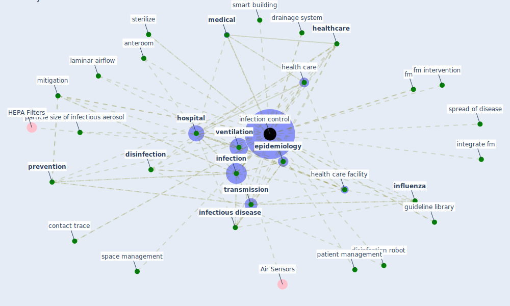

# Keyword: infection control

## Keywords

 * [aerosol](keyword_aerosol), american journal, [anteroom](keyword_anteroom), build ventilation, building operation, category study, cohorte, [contact](keyword_contact), contact trace, [control](keyword_control), [covid-19](keyword_covid-19), disease control, [disinfect](keyword_disinfect), [disinfection](keyword_disinfection), disinfection robot, drainage system, emerge infectious disease, [engineering](keyword_engineering), engineering control, [epidemiology](keyword_epidemiology), exhaust system, facility outbreak, fm, fm intervention, guideline library, hard service, [health](keyword_health), [health care](keyword_health_care), health care facility, health perspective, health service, [healthcare](keyword_healthcare), healthcare facility, healthcare worker, hepa filtering, hepa filtration, hosp, [hospital](keyword_hospital), hygiene, infected case, [infection](keyword_infection), [infection control](keyword_infection_control), infection control center, infection control observer, [infectious](keyword_infectious), [infectious disease](keyword_infectious_disease), [influenza](keyword_influenza), influenza like illness, integrate fm, laminar airflow, lockdown of much economic activity, [management](keyword_management), mechanism of fm intervention, [medical](keyword_medical), [mitigation](keyword_mitigation), mitigation measure, negative air ionization, [nursing](keyword_nursing), [pandemic](keyword_pandemic), particle filtration, particle size of infectious aerosol, particle size of infectious aerosols, patient management, [personal protective equipment](keyword_personal_protective_equipment), precaution, [prevention](keyword_prevention), prevention measure, protection, protection against all potentially important exposure pathway, protective device, [public health](keyword_public_health), public health surveillance, respiratory virus, risk assessment, safe work practice, [sar cov 2](keyword_sar_cov_2), sar cov 2 infection, self isolation, selfdisinfecting, selfdisinfecting surface, severe acute respiratory coronavirus virus 2, [smart building](keyword_smart_building), space management, spread of disease, sterilize, [strategy](keyword_strategy), systematic testing, [tb](keyword_tb), [transmission](keyword_transmission), triage, [tuberculosis](keyword_tuberculosis), ultraviolet c, uv lamp, [uv-c](keyword_uv-c), [uvgi](keyword_uvgi), [ventilation](keyword_ventilation), ventilation standard, virologist, [virus](keyword_virus), virus transmission

## Mapping

## Neighbours

### Closest articles

* A review of facilities management interventions to mitigate respiratory infections in existing buildings - [LINK](article_zhang_review_2022)
* ASHRAE Position Document on Infectious Aerosols - [LINK](article_ashrae_ashrae_2022)
* COVID-19 Prevention and Control Measures in Workplace Settings: A Rapid Review and Meta-Analysis - [LINK](article_ingram_covid-19_2021)
* Management of the COVID-19 pandemic: challenges, practices, and organizational support - [LINK](article_hossny_management_2022)
* How can airborne transmission of COVID-19 indoors be minimised? - [LINK](article_morawska_how_2020)
* Applications of ultraviolet germicidal irradiation disinfection in health care facilities: Effective adjunct, but not stand-alone technology - [LINK](article_memarzadeh_applications_2010)
* A Global Survey of Infection Control and Mitigation Measures for Combating the Transmission of COVID-19 Pandemic in Buildings Under Facilities Management Services - [LINK](article_sarvari_global_2022)
* COVID-19: Risk assessment and mitigation measures in healthcare and non-healthcare workplaces - [LINK](article_fawzy_covid-19_2021)
* Upper-Room Ultraviolet Light and Negative Air Ionization to Prevent Tuberculosis Transmission - [LINK](article_escombe_upper-room_2009)
* Environmental factors involved in SARS-CoV-2 transmission: effect and role of indoor environmental quality in the strategy for COVID-19 infection control - [LINK](article_azuma_environmental_2020)

### Closest BPs

