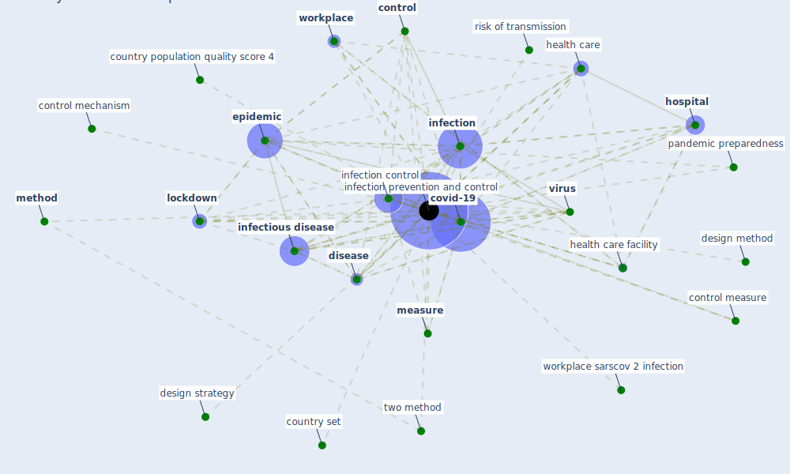

# Keyword: infection prevention and control

## Keywords

 * [control](keyword_control), control measure, control mechanism, country population quality score 4, country set, [covid-19](keyword_covid-19), design method, design strategy, [disease](keyword_disease), [epidemic](keyword_epidemic), [health care](keyword_health_care), health care facility, [hospital](keyword_hospital), [infection](keyword_infection), [infection control](keyword_infection_control), [infection prevention and control](keyword_infection_prevention_and_control), infection prevention and controls, [infectious disease](keyword_infectious_disease), [lockdown](keyword_lockdown), [measure](keyword_measure), [method](keyword_method), pandemic preparedness, risk of transmission, two method, [virus](keyword_virus), [workplace](keyword_workplace), workplace sarscov 2 infection

## Mapping

## Neighbours

### Closest articles

* Architectural design strategies for infection prevention and control (IPC) in health-care facilities: towards curbing the spread of Covid-19 \textbar SpringerLink - [LINK](article_udomiaye_architectural_2020)
* COVID-19 Prevention and Control Measures in Workplace Settings: A Rapid Review and Meta-Analysis - [LINK](article_ingram_covid-19_2021)
* A Review on Building Design as a Biomedical System for Preventing COVID-19 Pandemic - [LINK](article_amran_review_2022)
* A study on office workplace modification during the COVID-19 pandemic in The Netherlands - [LINK](article_hou_study_2021)
* Assessment of COVID-19 precautionary measures in sports facilities: A case study on a health club in Saudi Arabia - [LINK](article_ibrahim_assessment_2022)
* Borders and Catastrophe: lessons from COVID-19 for the European Green Deal - [LINK](article_klein_borders_2021)
* How can airborne transmission of COVID-19 indoors be minimised? - [LINK](article_morawska_how_2020)
* Persistence of coronaviruses on inanimate surfaces and their inactivation with biocidal agents - [LINK](article_kampf_persistence_2020)
* Designing a Multi-Agent Occupant Simulation System to Support Facility Planning and Analysis for COVID-19 - [LINK](article_lee_designing_2021)
* Association of built environment attributes with the spread of COVID-19 at its initial stage in China - [LINK](article_li_association_2021)

### Closest BPs

