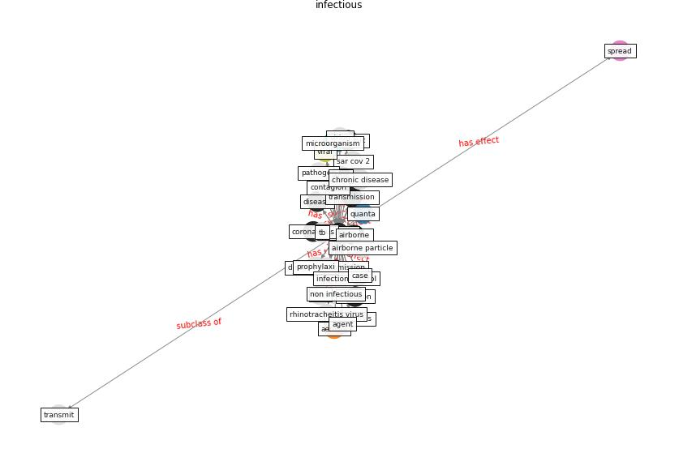

# Keyword: __infectious__
## Clusters

* Cluster 7: [climate-change](cluster_7)
* Cluster 12: [ontology-datum](cluster_12)

## Concepts

 

## Articles
* ashrae_ashrae_2022 ([ashrae_ashrae_2022](article_ashrae_ashrae_2022))
* The ventilation of buildings and other mitigating measures
for COVID-19: a focus on wintertime ([burridge_ventilation_2021](article_burridge_ventilation_2021))
* Air Disinfection for Airborne Infection Control
with a Focus on COVID-19: Why Germicidal UV is
Essential† ([nardell_air_2021](article_nardell_air_2021))
* Upper-Room Ultraviolet Light and Negative Air
Ionization to Prevent Tuberculosis Transmission ([escombe_upper-room_2009](article_escombe_upper-room_2009))
* A review of facilities management interventions to
mitigate respiratory infections in existing buildings ([zhang_review_2022](article_zhang_review_2022))
* Applications of ultraviolet germicidal irradiation
disinfection in health care facilities: Effective
adjunct, but not stand-alone technology ([memarzadeh_applications_2010](article_memarzadeh_applications_2010))
* Disinfection technology of hospital wastes and wastewater:
Suggestions for disinfection strategy during coronavirus
Disease 2019 (COVID-19) pandemic in China ([wang_disinfection_2020](article_wang_disinfection_2020))
* COVID-19 Prevention and Control Measures in
Workplace Settings: A Rapid Review and
Meta-Analysis ([ingram_covid-19_2021](article_ingram_covid-19_2021))
* How can airborne transmission of COVID-19 indoors be
minimised? ([morawska_how_2020](article_morawska_how_2020))
* Persistence of coronaviruses on inanimate surfaces and
their inactivation with biocidal agents ([kampf_persistence_2020](article_kampf_persistence_2020))
