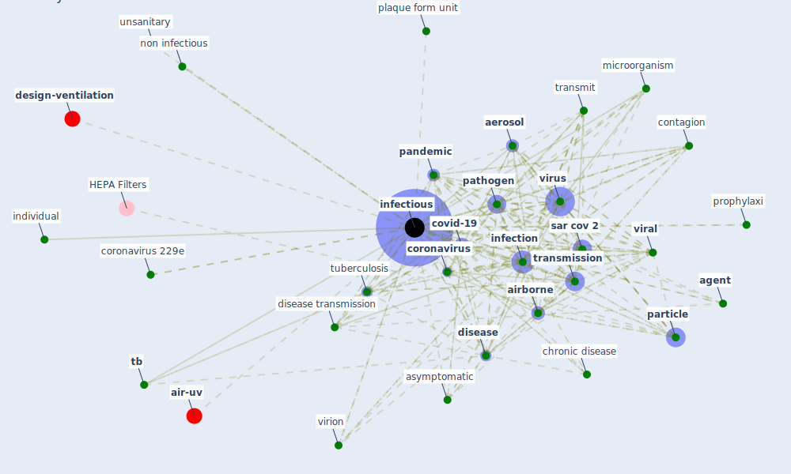

# Keyword: infectious

* [design-ventilation](cluster_10)

* [air-uv](cluster_12)

## Keywords

 * Cluster_10, Cluster_12, aero sol, [aerosol](keyword_aerosol), aerosol transmission, aerosol transmission distance, [agent](keyword_agent), [airborne](keyword_airborne), airborne disease, airborne particle, asymptomatic, campylobacter, [case](keyword_case), [chronic disease](keyword_chronic_disease), [climate change](keyword_climate_change), [clinical](keyword_clinical), contagion, [control](keyword_control), [coronavirus](keyword_coronavirus), coronavirus 229e, [covid-19](keyword_covid-19), diarrhea, [disease](keyword_disease), disease transmission, [droplet](keyword_droplet), [healthcare](keyword_healthcare), host, human coronavirus, human coronavirus 229e, [impact](keyword_impact), impetious, individual, [infection](keyword_infection), [infection control](keyword_infection_control), [infectious](keyword_infectious), infectious agent, infectious quantum, infectious subj aerosol, infectious subj microorganism, infectiousdiseasecases, infectiousness, [influenza](keyword_influenza), [influenza virus](keyword_influenza_virus), localize outbreak of tb infect animal, [microorganism](keyword_microorganism), mode of transmission, non infectious, number of infectious individual, omicron, [outbreak](keyword_outbreak), [pandemic](keyword_pandemic), [particle](keyword_particle), [pathogen](keyword_pathogen), plaque form unit, [pollutant](keyword_pollutant), potentially infectious, prophylaxi, [public health](keyword_public_health), quanta, [quarantine](keyword_quarantine), recover, rhinotracheitis virus, rtqpcr, [sar cov 2](keyword_sar_cov_2), share risk profile, sick, [spread](keyword_spread), [tb](keyword_tb), tissue culture, [transmission](keyword_transmission), transmission distance, transmit, treat wastewater, [tuberculosis](keyword_tuberculosis), unsanitary, [viral](keyword_viral), virion, [virus](keyword_virus), waste

## Mapping

## Neighbours

### Closest articles

* ASHRAE Position Document on Infectious Aerosols - [LINK](article_ashrae_ashrae_2022)
* The ventilation of buildings and other mitigating measures for COVID-19: a focus on wintertime - [LINK](article_burridge_ventilation_2021)
* Air Disinfection for Airborne Infection Control with a Focus on COVID‐19: Why Germicidal UV is Essential             † - [LINK](article_nardell_air_2021)
* Upper-Room Ultraviolet Light and Negative Air Ionization to Prevent Tuberculosis Transmission - [LINK](article_escombe_upper-room_2009)
* A review of facilities management interventions to mitigate respiratory infections in existing buildings - [LINK](article_zhang_review_2022)
* Applications of ultraviolet germicidal irradiation disinfection in health care facilities: Effective adjunct, but not stand-alone technology - [LINK](article_memarzadeh_applications_2010)
* A critical review of heating, ventilation, and air conditioning (HVAC) systems within the context of a global SARS-CoV-2 epidemic - [LINK](article_elsaid_critical_2021)
* Prototype Early Warning Systems for Vector-Borne Diseases in Europe - [LINK](article_semenza_prototype_2015)
* Disinfection technology of hospital wastes and wastewater: Suggestions for disinfection strategy during coronavirus Disease 2019 (COVID-19) pandemic in China - [LINK](article_wang_disinfection_2020)
* How can airborne transmission of COVID-19 indoors be minimised? - [LINK](article_morawska_how_2020)

### Closest BPs

