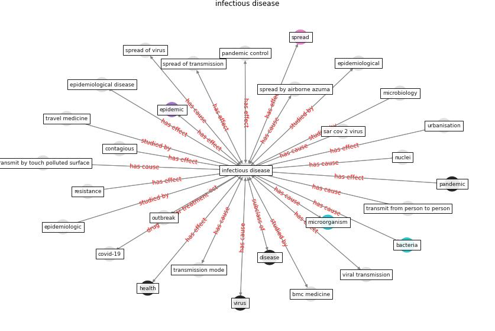

# Keyword: __infectious disease__

## Concepts

 

## Top articles for __infectious disease__
* Adaptive Design of the Built Environment to
Mitigate the Transmission Risk of COVID-19 ([ara_dilshad_shangi_adaptive_2020](article_ara_dilshad_shangi_adaptive_2020))
* yan_10_2020 ([yan_10_2020](article_yan_10_2020))
* An Overview of Biomedical Ontologies for Pandemics
and Infectious Diseases Representation ([bayoudhi_overview_2021](article_bayoudhi_overview_2021))
* How Can Blockchain Help People in the Event of
Pandemics Such as the COVID-19? ([chang_how_2020](article_chang_how_2020))
* Wastewater surveillance for population-wide Covid-19:
The present and future ([daughton_wastewater_2020](article_daughton_wastewater_2020))
* Epidemics, Planning and the City: A Special
Issue of Planning Perspectives ([davis_epidemics_2022](article_davis_epidemics_2022))
* yan_10_2020 ([yan_10_2020](article_yan_10_2020))
* yan_10_2020 ([yan_10_2020](article_yan_10_2020))
* yan_10_2020 ([yan_10_2020](article_yan_10_2020))
* yan_10_2020 ([yan_10_2020](article_yan_10_2020))
* COVID-19 Could Leverage a Sustainable Built
Environment ([pinheiro_covid-19_2020](article_pinheiro_covid-19_2020))
* The COVID-19 epidemiology and monitoring ontology ([queralt-rosinach_covid-19_2021](article_queralt-rosinach_covid-19_2021))
* yan_10_2020 ([yan_10_2020](article_yan_10_2020))
* The Socio-Spatial Determinants of COVID-19
Diffusion: The Impact of Globalisation,
Settlement Characteristics and Population ([sigler_socio-spatial_2020](article_sigler_socio-spatial_2020))
* Future perspectives of wastewater-based epidemiology:
Monitoring infectious disease spread and resistance to
the community level ([sims_future_2020](article_sims_future_2020))
* yan_10_2020 ([yan_10_2020](article_yan_10_2020))
* Combating COVID-19—The role of robotics in managing
public health and infectious diseases ([yang_combating_2020](article_yang_combating_2020))
