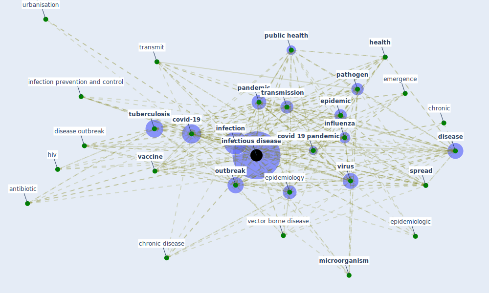

# Keyword: infectious disease

## Keywords

 * [airborne](keyword_airborne), allergy, alter, [antibiotic](keyword_antibiotic), [architecture](keyword_architecture), avian h5n1 epidemic, [bioaerosol](keyword_bioaerosol), bmc medicine, cause, [cholera](keyword_cholera), [chronic](keyword_chronic), [chronic disease](keyword_chronic_disease), [climate change](keyword_climate_change), communicable disease, comorbiditie, contagious, [coronavirus](keyword_coronavirus), [covid 19 pandemic](keyword_covid_19_pandemic), [covid-19](keyword_covid-19), diffuse, direct transmission, [disease](keyword_disease), disease cause organism, disease outbreak, disease spread, driver, dynamic, dysentery, ebola, [economic](keyword_economic), emerge infectious disease, emergence, [epidemic](keyword_epidemic), epidemiologic, [epidemiological](keyword_epidemiological), [epidemiology](keyword_epidemiology), [health](keyword_health), health burden, [hiv](keyword_hiv), [human health](keyword_human_health), illness, [impact](keyword_impact), [infection](keyword_infection), [infection control](keyword_infection_control), [infection prevention and control](keyword_infection_prevention_and_control), [infectious disease](keyword_infectious_disease), [influenza](keyword_influenza), [knowledge](keyword_knowledge), [lockdown](keyword_lockdown), [malaria](keyword_malaria), microbiology, [microorganism](keyword_microorganism), non infectious, non infectious diseases, non pharmaceutical, noncommunicable, nosocomial, [outbreak](keyword_outbreak), [pandemic](keyword_pandemic), pandemic control, pandemic influenza, [pathogen](keyword_pathogen), pathogenesis, polio, prevent, propagate, [public health](keyword_public_health), [respiratory](keyword_respiratory), [risk](keyword_risk), risk factor, roman empire, [sar cov 2](keyword_sar_cov_2), sar cov 2 virus, seasonal, secondary host, severe acute respiratory syndrome, [society](keyword_society), socioeconomic, [spread](keyword_spread), spread by airborne azuma, [surveillance](keyword_surveillance), [symptom](keyword_symptom), the lancet, tran mitte, transfer of the air, [transmission](keyword_transmission), transmission mode, transmit, transmit by touch polluted surface, travel medicine, [tuberculosis](keyword_tuberculosis), urbanisation, [vaccine](keyword_vaccine), [vector](keyword_vector), [vector borne disease](keyword_vector_borne_disease), [viral](keyword_viral), [virus](keyword_virus), vol 12 no 1, [vulnerability](keyword_vulnerability), zoonotic

## Mapping

## Neighbours

### Closest articles

* COVID-19 Could Leverage a Sustainable Built Environment - [LINK](article_pinheiro_covid-19_2020)
* An Overview of Biomedical Ontologies for Pandemics and Infectious Diseases Representation - [LINK](article_bayoudhi_overview_2021)
* Future perspectives of wastewater-based epidemiology: Monitoring infectious disease spread and resistance to the community level - [LINK](article_sims_future_2020)
* A Review on Building Design as a Biomedical System for Preventing COVID-19 Pandemic - [LINK](article_amran_review_2022)
* Architectural design strategies for infection prevention and control (IPC) in health-care facilities: towards curbing the spread of Covid-19 \textbar SpringerLink - [LINK](article_udomiaye_architectural_2020)
* Prototype Early Warning Systems for Vector-Borne Diseases in Europe - [LINK](article_semenza_prototype_2015)
* The Socio-Spatial Determinants of COVID-19 Diffusion: The Impact of Globalisation, Settlement Characteristics and Population - [LINK](article_sigler_socio-spatial_2020)
* A Global Survey of Infection Control and Mitigation Measures for Combating the Transmission of COVID-19 Pandemic in Buildings Under Facilities Management Services - [LINK](article_sarvari_global_2022)
* ASHRAE Position Document on Infectious Aerosols - [LINK](article_ashrae_ashrae_2022)
* Adaptive Design of the Built Environment to Mitigate the Transmission Risk of COVID-19 - [LINK](article_ara_dilshad_shangi_adaptive_2020)

### Closest BPs

